# Agent On the Fly — Architecture Document

**Author:** hieutrungdao
**Date:** 2026-04-13
**Version:** 1.1
**Status:** Draft

### Changelog

- **1.1 (2026-04-13)** — Adversarial review revisions: introduced `CLIAgentBackendBase` to support Claude Code, Codex CLI, and OpenCode as first-class backends; split watchers into streaming and polling abstractions to support Grafana/Loki/Datadog; added Auto-Fix Safety Model (approval gates, dry-run, scope limits, rollback, fix concurrency control); added Plugin Security model (allowlist + checksum + capability scoping); replaced single-password dashboard auth with token-based multi-user + audit log; fixed flow diagram to branch event bus to storage and notify-with-rate-limit independently; added Context Window Management strategy; added Git Failure Mode Handling.
- **1.0 (2026-04-04)** — Initial draft.

---

## Overview

Agent On the Fly (AOTF) is an AI-powered SDLC health platform with a layered, plugin-driven architecture. The system is designed around a core event loop (detect → diagnose → fix) with every external integration abstracted behind plugin interfaces.

The architecture prioritizes:
- **Zero-config local operation** — Works out of the box with SQLite and file-based log watching
- **Plugin extensibility** — AI backends, CI providers, notifications, and log sources are all swappable
- **CLI-first interaction** — All capabilities accessible via command line; web dashboard is optional
- **Production-proven patterns** — Core engine extracted from xMainframe CI/CD Automation (battle-tested 24/7 system)

---

## Decision Summary

| # | Category | Decision | Choice | Rationale |
|---|---|---|---|---|
| 1 | Language | Implementation language | **Python 3.11+** | AI ecosystem (LangChain, transformers), existing CICD codebase in Python, async/await, type hints |
| 2 | CLI Framework | Command interface | **Click + Rich** | Click for declarative commands/options; Rich for terminal formatting, tables, progress bars |
| 3 | Web Framework | Dashboard API | **FastAPI** | Async, Pydantic integration, SSE support, proven in source CICD module |
| 4 | Default Storage | Local persistence | **SQLite** | Zero-config, single file, no server process; pluggable to Postgres/MongoDB via repository pattern |
| 5 | AI Abstraction | AI backend interface | **Two-tier ABC: `AIBackendABC` + `CLIAgentBackendBase`** | First tier covers SDK-style backends (GPT, Gemini, local). Second tier is shared base for CLI-agent wrappers (Claude Code, Codex CLI, OpenCode) handling subprocess lifecycle, JSON event streaming, tool-call parsing |
| 5b | AI CLI Wrapping | Default AI execution model | **Subprocess wrapping of agentic CLIs** | Claude Code / Codex CLI / OpenCode provide multi-turn agent loops with tool use that raw API calls don't; wrapping them gives full agent capability without re-implementing tool dispatch |
| 5c | Watcher Categories | Log source modeling | **Two ABCs: `StreamingLogWatcherABC` + `PollingLogWatcherABC`** | Streaming (file tail, Docker SDK, stdin) and polling (Grafana, Loki, Datadog, CloudWatch, Elasticsearch) have different state, failure modes, and rate-limit profiles |
| 5d | Auto-Fix Safety | Safety model for `full_auto` | **Approval gates + dry-run + scope limits + rollback + fix mutex** | AI-generated fixes auto-merging on green CI is unacceptable without explicit safeguards; mutex prevents concurrent fixes from racing on the same repo |
| 5e | Plugin Security | Plugin trust model | **Allowlist + SHA-256 checksum + capability scoping** | Plugins execute at full process privilege; ABC compliance alone is not a security model for a tool that auto-commits and auto-merges code |
| 6 | CI Abstraction | CI provider interface | **Abstract base class + plugin registry** | Enables GitHub Actions (default), GitLab CI, Azure DevOps, Jenkins |
| 7 | Notification Abstraction | Notification interface | **Abstract base class + plugin registry** | Enables console (default), Slack, Teams, Discord, Email, PagerDuty |
| 8 | Configuration | Config system | **YAML + env vars + Pydantic v2** | 12-factor; hierarchical: defaults < config file < env vars < CLI flags |
| 9 | Distribution | Package distribution | **PyPI (primary) + Homebrew tap** | Standard Python packaging; Homebrew for macOS convenience |
| 10 | Plugin Discovery | Plugin loading | **setuptools entry_points + local dir scanning** | Standard Python plugin pattern; supports PyPI-distributed and local plugins |
| 11 | Log Watching | Log source handling | **Pluggable watchers: file tail, Docker SDK, stdin** | Extensible; Docker watcher extracted from existing CICD docker_status.py |
| 12 | Async Runtime | Concurrency model | **asyncio + anyio** | Native Python async; anyio for structured concurrency and cancellation |
| 13 | Structured Logging | Application logging | **structlog (JSON)** | Machine-parseable, configurable verbosity, zero-config defaults |
| 14 | Testing | Test framework | **pytest + pytest-asyncio** | Standard Python testing; async test support; rich plugin ecosystem |

---

## Architecture Diagram

```mermaid
flowchart TD
    subgraph CLI["CLI Layer (Click + Rich)"]
        INIT["aotf init"]
        WATCH["aotf watch"]
        ERRORS["aotf errors list"]
        DIAGNOSE["aotf diagnose"]
        FIX["aotf fix"]
        DASHBOARD_CMD["aotf dashboard"]
        PLUGIN_CMD["aotf plugin list/install"]
    end

    subgraph CORE["Core Engine"]
        SCHEDULER["Scheduler<br/>(asyncio loop)"]
        EVENT_BUS["Event Bus<br/>(async queues)"]
        DEDUP["Deduplicator<br/>(content hashing)"]
        RATE_LIMIT["Rate Limiter<br/>(per-channel throttle)"]
    end

    subgraph DETECTION["Detection Layer"]
        WATCHER_MGR["Watcher Manager"]
        subgraph STREAM_W["Streaming Watchers"]
            FILE_WATCHER["File Tail Watcher"]
            DOCKER_WATCHER["Docker Log Watcher"]
            STDIN_WATCHER["Stdin Watcher"]
        end
        subgraph POLL_W["Polling Watchers"]
            LOKI_WATCHER["Loki Watcher<br/>(plugin)"]
            GRAFANA_WATCHER["Grafana Watcher<br/>(plugin)"]
            DATADOG_WATCHER["Datadog Watcher<br/>(plugin)"]
            CLOUDWATCH_WATCHER["CloudWatch Watcher<br/>(plugin)"]
        end
        REGEX_DETECTOR["Regex Error Detector"]
    end

    subgraph AI["AI Layer"]
        AI_ROUTER["AI Backend Router"]
        PROMPT_TPL["Prompt Templates"]
        CTX_BUILDER["Context Builder<br/>(token budget)"]
        RESULT_PARSER["Result Parser"]
        subgraph CLI_AGENTS["CLI Agent Backends (default tier)"]
            CLAUDE_CODE["Claude Code CLI<br/>(default)"]
            CODEX_CLI["Codex CLI<br/>(plugin)"]
            OPENCODE_CLI["OpenCode CLI<br/>(plugin)"]
        end
        subgraph SDK_BACKENDS["SDK Backends (alt tier)"]
            GPT_BACKEND["GPT API Backend<br/>(plugin)"]
            GEMINI_BACKEND["Gemini API Backend<br/>(plugin)"]
            LOCAL_BACKEND["Local Model Backend<br/>(plugin)"]
        end
    end

    subgraph SAFETY["Auto-Fix Safety"]
        APPROVAL["Approval Gate"]
        DRY_RUN["Dry Run Renderer"]
        SCOPE["Change Scope Limiter"]
        FIX_MUTEX["Per-Repo Fix Mutex"]
        ROLLBACK["Rollback Manager"]
    end

    subgraph INTEGRATION["Integration Layer"]
        CI_ROUTER["CI Provider Router"]
        GIT_OPS["Git Operations<br/>(branch, commit, push)"]
        GH_ACTIONS["GitHub Actions<br/>(default)"]
        GITLAB_CI["GitLab CI<br/>(plugin)"]
        AZURE_DEVOPS["Azure DevOps<br/>(plugin)"]
        JENKINS["Jenkins<br/>(plugin)"]
    end

    subgraph NOTIFY["Notification Layer"]
        NOTIFY_ROUTER["Notification Router"]
        CONSOLE_NOTIFY["Console<br/>(default, Rich)"]
        SLACK_NOTIFY["Slack<br/>(plugin)"]
        TEAMS_NOTIFY["Teams<br/>(plugin)"]
        EMAIL_NOTIFY["Email<br/>(plugin)"]
    end

    subgraph PLUGINS["Plugin Registry"]
        DISCOVERY["Entry Point Discovery"]
        LOCAL_SCAN["Local Dir Scanner<br/>(.aotf/plugins/)"]
        VALIDATOR["Plugin Validator"]
        LIFECYCLE["Lifecycle Manager"]
    end

    subgraph STORAGE["Storage Layer"]
        REPO_ABC["Repository ABC"]
        SQLITE_REPO["SQLite Repository<br/>(default)"]
        PG_REPO["PostgreSQL Repository<br/>(plugin)"]
        MONGO_REPO["MongoDB Repository<br/>(plugin)"]
        MIGRATIONS["Schema Migrations"]
    end

    subgraph WEB["Dashboard Layer (optional)"]
        FASTAPI["FastAPI Server"]
        SSE["SSE Streaming"]
        HTMX["HTMX Templates"]
        TOKEN_AUTH["Token Auth + Audit Log<br/>(multi-user)"]
    end

    %% CLI → Core
    WATCH --> SCHEDULER
    DIAGNOSE --> AI_ROUTER
    FIX --> AI_ROUTER
    FIX --> APPROVAL
    APPROVAL --> CI_ROUTER
    ERRORS --> REPO_ABC
    DASHBOARD_CMD --> FASTAPI
    PLUGIN_CMD --> DISCOVERY

    %% Core → Detection
    SCHEDULER --> WATCHER_MGR
    WATCHER_MGR --> FILE_WATCHER
    WATCHER_MGR --> DOCKER_WATCHER
    WATCHER_MGR --> STDIN_WATCHER
    WATCHER_MGR --> LOKI_WATCHER
    WATCHER_MGR --> GRAFANA_WATCHER
    WATCHER_MGR --> DATADOG_WATCHER
    WATCHER_MGR --> CLOUDWATCH_WATCHER
    FILE_WATCHER --> REGEX_DETECTOR
    DOCKER_WATCHER --> REGEX_DETECTOR
    STDIN_WATCHER --> REGEX_DETECTOR
    LOKI_WATCHER --> REGEX_DETECTOR
    GRAFANA_WATCHER --> REGEX_DETECTOR
    DATADOG_WATCHER --> REGEX_DETECTOR
    CLOUDWATCH_WATCHER --> REGEX_DETECTOR

    %% Detection → Core (event bus fan-out)
    REGEX_DETECTOR --> DEDUP
    DEDUP --> EVENT_BUS
    EVENT_BUS --> REPO_ABC
    EVENT_BUS --> RATE_LIMIT
    RATE_LIMIT --> NOTIFY_ROUTER

    %% AI routing
    AI_ROUTER --> CTX_BUILDER
    CTX_BUILDER --> PROMPT_TPL
    AI_ROUTER --> CLAUDE_CODE
    AI_ROUTER --> CODEX_CLI
    AI_ROUTER --> OPENCODE_CLI
    AI_ROUTER --> GPT_BACKEND
    AI_ROUTER --> GEMINI_BACKEND
    AI_ROUTER --> LOCAL_BACKEND
    CLAUDE_CODE --> RESULT_PARSER
    CODEX_CLI --> RESULT_PARSER
    OPENCODE_CLI --> RESULT_PARSER
    GPT_BACKEND --> RESULT_PARSER
    GEMINI_BACKEND --> RESULT_PARSER
    LOCAL_BACKEND --> RESULT_PARSER

    %% Safety guards before CI
    APPROVAL --> DRY_RUN
    APPROVAL --> SCOPE
    APPROVAL --> FIX_MUTEX
    CI_ROUTER --> ROLLBACK

    %% CI routing
    CI_ROUTER --> GIT_OPS
    CI_ROUTER --> GH_ACTIONS
    CI_ROUTER --> GITLAB_CI
    CI_ROUTER --> AZURE_DEVOPS
    CI_ROUTER --> JENKINS

    %% Notification routing
    NOTIFY_ROUTER --> CONSOLE_NOTIFY
    NOTIFY_ROUTER --> SLACK_NOTIFY
    NOTIFY_ROUTER --> TEAMS_NOTIFY
    NOTIFY_ROUTER --> EMAIL_NOTIFY

    %% Plugin registry (validates + scopes capabilities)
    PLUGINS --> AI_ROUTER
    PLUGINS --> CI_ROUTER
    PLUGINS --> NOTIFY_ROUTER
    PLUGINS --> WATCHER_MGR
    PLUGINS --> REPO_ABC
    VALIDATOR --> DISCOVERY
    VALIDATOR --> LOCAL_SCAN

    %% Storage
    REPO_ABC --> SQLITE_REPO
    REPO_ABC --> PG_REPO
    REPO_ABC --> MONGO_REPO
    SQLITE_REPO --> MIGRATIONS

    %% Dashboard
    FASTAPI --> SSE
    FASTAPI --> HTMX
    FASTAPI --> AUTH
    FASTAPI --> REPO_ABC
    SSE --> EVENT_BUS
```



---

## Component Details

### 1. CLI Layer

**Responsibility:** Parse user commands, invoke core engine operations, format output.

**Technology:** Click for command routing, Rich for terminal output (tables, panels, progress bars, syntax highlighting).

**Key Commands:**

| Command | Description | Maps to |
|---|---|---|
| `aotf init` | Scaffold `.aotf/config.yaml` with project defaults | Config system |
| `aotf watch` | Start daemon monitoring log sources | Scheduler + Watcher Manager |
| `aotf errors list` | Query and display error history | Storage layer |
| `aotf diagnose <id>` | Run AI root-cause analysis | AI layer |
| `aotf fix <id>` | Create fix branch/PR (passes through Auto-Fix Safety gates) | AI + Safety + Integration layers |
| `aotf fix <id> --dry-run` | Render fix as diff + summary without applying | AI + Safety (Dry-Run only) |
| `aotf fix rollback <id>` | Delete fix branch (unmerged) or open revert PR (merged) | Safety + Integration |
| `aotf approve <fix_id>` | Approve a queued fix awaiting human review | Safety (Approval Gate) |
| `aotf dashboard` | Launch optional web UI | Dashboard layer |
| `aotf plugin list` | Show installed + available plugins with trust status | Plugin registry |
| `aotf plugin install <name>` | Install plugin and add to `.aotf/plugins.lock.yaml` | Plugin registry |
| `aotf plugin trust <name>` | Confirm plugin capabilities and update lock file | Plugin registry |
| `aotf user create <name> --role` | Create dashboard user + emit token | Dashboard auth |
| `aotf config show` | Display current configuration | Config system |

**File Locations:**
```
src/aotf/cli/
├── __init__.py              # Click group root
├── main.py                  # Entry point, top-level group
├── watch.py                 # aotf watch command
├── errors.py                # aotf errors list/show commands
├── diagnose.py              # aotf diagnose command
├── fix.py                   # aotf fix command
├── dashboard.py             # aotf dashboard command
├── plugin.py                # aotf plugin list/install/trust commands
├── user.py                  # aotf user create/list/revoke commands
└── config_cmd.py            # aotf config show/set commands
```

### 2. Core Engine

**Responsibility:** Orchestrate the detect → diagnose → fix event loop; manage scheduling, event routing, deduplication, and rate limiting.

**Key Interfaces:**

```python
class EventBus:
    """Async pub/sub for internal events (error_detected, diagnosis_complete, fix_created)."""
    async def publish(self, event: Event) -> None: ...
    async def subscribe(self, event_type: str, handler: Callable) -> None: ...

class Deduplicator:
    """Content-hash based deduplication with configurable TTL."""
    def is_duplicate(self, error: DetectedError) -> bool: ...

class RateLimiter:
    """Per-channel rate limiting for notifications."""
    def should_send(self, channel: str, event: Event) -> bool: ...
```

**File Locations:**
```
src/aotf/core/
├── engine.py                # Main event loop orchestrator
├── event_bus.py             # Async pub/sub (storage + notify subscribe independently)
├── deduplicator.py          # Content hash dedup (from CICD _seen_error_hashes)
├── rate_limiter.py          # Per-channel throttle (from CICD watchdog) — NOTIFY path only
└── scheduler.py             # asyncio scheduling wrapper
```

### 3. Detection Layer

**Responsibility:** Watch log sources for errors; parse and classify detected issues.

Watchers split into two ABCs because **streaming sources** (file tail, Docker SDK, stdin) and **polling sources** (Loki, Grafana, Datadog, CloudWatch, Elasticsearch) have different lifecycle, state, and failure-mode requirements:

- Streaming holds an open connection and yields events asynchronously; state = file offset / connection cursor.
- Polling issues time-windowed queries; state = `last_seen_timestamp` + `last_seen_log_id` for resume-without-duplicates; needs configurable per-source poll interval, query backoff, and API quota awareness.

**Key Interfaces:**

```python
class LogWatcherABC(ABC):
    """Common protocol both streaming and polling watchers implement."""
    name: str
    @abstractmethod
    async def start(self) -> None: ...
    @abstractmethod
    async def stop(self) -> None: ...
    @abstractmethod
    def health(self) -> WatcherHealth: ...

class StreamingLogWatcherABC(LogWatcherABC):
    """For sources that push events: file tail, Docker SDK, stdin."""
    @abstractmethod
    async def stream(self) -> AsyncIterator[LogLine]: ...

class PollingLogWatcherABC(LogWatcherABC):
    """For sources queried via time-windowed APIs: Loki, Grafana, Datadog, etc."""
    poll_interval: int                              # seconds
    @abstractmethod
    async def query(self, since: datetime, until: datetime) -> AsyncIterator[LogLine]: ...
    @abstractmethod
    def cursor(self) -> WatcherCursor: ...          # persisted to storage for resume

class ErrorDetectorABC(ABC):
    """Abstract base class for error detection strategies."""
    @abstractmethod
    def detect(self, line: LogLine) -> Optional[DetectedError]: ...
```

**Built-in Streaming Watchers:**
- `FileTailWatcher` — Follows log files with rotation handling (watchdog library)
- `DockerLogWatcher` — Docker SDK log streaming (extracted from CICD `docker_status.py`)
- `StdinWatcher` — Reads from piped stdin for CI integration

**Built-in Polling Watchers (Growth — plugin extras):**
- `LokiWatcher` — `/loki/api/v1/query_range` with LogQL filters; cursor = `(end_ts, last_id)`
- `GrafanaWatcher` — Grafana data source proxy; resolves data source by UID, delegates to Loki/Elasticsearch query
- `DatadogWatcher` — `/api/v2/logs/events` with cursor-based pagination
- `CloudWatchWatcher` — `FilterLogEvents` API with `nextToken` pagination
- `ElasticsearchWatcher` — `_search` with PIT + `search_after` for stable pagination

**Detector:**
- `RegexErrorDetector` — Configurable regex patterns (extracted from CICD watchdog patterns)

**Watcher Manager Responsibilities:**
- Lifecycle for both watcher classes (start/stop/restart on failure with exponential backoff)
- Cursor persistence for polling watchers (writes to storage via `WatcherCursorRepo`)
- Per-source health reporting surfaced via `aotf watch status`
- Backpressure: if downstream event bus is saturated, polling watchers pause new queries

**File Locations:**
```
src/aotf/detection/
├── watchers/
│   ├── base.py              # LogWatcherABC, StreamingLogWatcherABC, PollingLogWatcherABC
│   ├── streaming/
│   │   ├── file_watcher.py
│   │   ├── docker_watcher.py
│   │   └── stdin_watcher.py
│   └── polling/
│       ├── loki_watcher.py
│       ├── grafana_watcher.py
│       ├── datadog_watcher.py
│       ├── cloudwatch_watcher.py
│       └── elasticsearch_watcher.py
├── detectors/
│   ├── base.py              # ErrorDetectorABC
│   └── regex_detector.py
├── cursor.py                # WatcherCursor + WatcherCursorRepo
└── manager.py               # Lifecycle, health, backpressure
```

### 4. AI Layer

**Responsibility:** Abstract AI backend interactions; manage prompt construction, context-window budgeting, result parsing, and confidence scoring.

The AI layer uses a **two-tier ABC hierarchy**. The top-level `AIBackendABC` defines the diagnose/fix contract. Underneath it sits `CLIAgentBackendBase` — a shared base that handles subprocess lifecycle, JSON event streaming, and tool-call parsing for agentic CLI tools (Claude Code, Codex CLI, OpenCode). SDK-style backends (OpenAI, Gemini, Ollama) inherit `AIBackendABC` directly.

CLI agents are the **default tier** because they ship with multi-turn agent loops, file-editing tools, and subprocess management — which AOTF would otherwise have to re-implement on top of raw API calls.

**Key Interfaces:**

```python
class AIBackendABC(ABC):
    """Top-level contract: diagnose an error, optionally suggest a fix."""
    name: str
    @abstractmethod
    async def diagnose(self, context: DiagnosisContext) -> DiagnosisResult: ...
    @abstractmethod
    async def suggest_fix(self, diagnosis: DiagnosisResult) -> FixSuggestion: ...
    def supports_agentic_fix(self) -> bool:
        """True if the backend can apply file changes itself (CLI agents); False if it only emits a suggested diff (SDK backends)."""
        return False

class CLIAgentBackendBase(AIBackendABC):
    """Shared base for subprocess-wrapped agentic CLIs.

    Subclasses override:
      build_command(mode, context)  -> list[str]
      parse_event(line)             -> AgentEvent | None   # JSON-line / NDJSON parsing
      extract_result(events)        -> DiagnosisResult | FixSuggestion
    """
    cli_path: str                              # resolved at init from PATH or config
    timeout_seconds: int
    env: dict[str, str]                        # API keys, model selection

    async def _run(self, mode: Literal["diagnose", "fix"], context) -> list[AgentEvent]:
        """Spawn subprocess, stream stdout, parse each line as AgentEvent, enforce timeout."""

    def supports_agentic_fix(self) -> bool:
        return True

@dataclass
class AgentEvent:
    """Normalized event across CLI agents (Claude Code, Codex CLI, OpenCode)."""
    type: Literal["tool_use", "tool_result", "text", "error", "session_end"]
    tool_name: str | None
    tool_input: dict | None
    tool_output: str | None
    text: str | None
    raw: dict                                  # original CLI-specific payload

@dataclass
class DiagnosisContext:
    error: DetectedError
    source_files: list[SourceFile]             # Already token-budgeted by ContextBuilder
    log_snippet: str                           # Surrounding log lines (token-bounded)
    recent_changes: list[GitCommit]            # Recent git history (capped)
    config: dict
    token_budget: TokenBudget                  # Per-section limits applied upstream

@dataclass
class DiagnosisResult:
    root_cause: str
    affected_files: list[AffectedFile]         # path + line number
    suggested_fix: str
    confidence: int                            # 0-100
    reasoning: str                             # Chain-of-thought explanation
    backend_name: str                          # For audit + reproducibility
    tokens_used: TokensUsed                    # input/output/cache for observability

@dataclass
class FixSuggestion:
    changes: list[FileChange]                  # file path + unified diff
    commit_message: str
    pr_title: str
    pr_body: str
    estimated_blast_radius: BlastRadius        # For Scope Limiter (#section: Auto-Fix Safety)
```

**Built-in CLI Agent Backends:**
- `ClaudeCodeBackend` — Wraps `claude` CLI with `--output-format stream-json --verbose`. Default. Extracted from CICD `claude_executor.py`.
- `CodexCLIBackend` — Wraps `codex` CLI; parses Codex-native event stream.
- `OpenCodeBackend` — Wraps `opencode` CLI; parses its NDJSON event format.

All three inherit `CLIAgentBackendBase` and only override `build_command()`, `parse_event()`, and `extract_result()` — subprocess lifecycle, timeout, and stream handling are shared.

**Built-in SDK Backends (Growth — plugin extras):**
- `OpenAIBackend` — `chat.completions` API
- `GeminiBackend` — `generateContent` API
- `LocalBackend` — Ollama / llama.cpp HTTP API

#### Context Window Management

A real codebase will overflow any single-prompt budget. The AI layer enforces a **layered budget** before invoking any backend:

| Section | Default share | Strategy when over budget |
|---|---|---|
| Error message + log snippet | 10% | Truncate to first/last N lines around the matched line |
| Recent git history | 10% | Keep most-recent N commits; drop diffs, keep messages + file lists |
| Source files | 70% | Rank by: (a) file mentioned in error trace, (b) file changed in recent commits, (c) imports of (a). Apply per-file budget; chunk large files around relevant symbols |
| System + instructions | 10% | Fixed |

Implementation lives in `ai/context_builder.py`. Backend-specific token limits are declared in each backend's `max_input_tokens` attribute; the builder reads it and apportions before serializing the prompt. When budget cannot be met even after truncation, the backend returns `DiagnosisResult` with `confidence=0` and `reasoning="context_overflow: ..."` rather than silently dropping data.

**File Locations:**
```
src/aotf/ai/
├── base.py                  # AIBackendABC, CLIAgentBackendBase, AgentEvent
├── context_builder.py       # Token-budgeted DiagnosisContext assembly
├── token_budget.py          # TokenBudget, per-backend caps
├── prompt_templates.py      # Jinja2 templates for diagnosis/fix prompts
├── result_parser.py         # Extract DiagnosisResult/FixSuggestion from AgentEvents
└── backends/
    ├── claude_code.py       # ClaudeCodeBackend (default, from CICD claude_executor.py)
    ├── codex_cli.py         # CodexCLIBackend
    ├── opencode_cli.py      # OpenCodeBackend
    ├── openai.py            # OpenAIBackend (Growth, SDK tier)
    ├── gemini.py            # GeminiBackend (Growth, SDK tier)
    └── local.py             # LocalBackend (Growth, SDK tier)
```

### 5. Integration Layer

**Responsibility:** Manage git operations and CI provider interactions for auto-fix workflows.

**Key Interfaces:**

```python
class CIProviderABC(ABC):
    """Abstract base class for CI/CD provider plugins."""
    @abstractmethod
    async def create_pr(self, branch: str, title: str, body: str) -> PRResult: ...
    @abstractmethod
    async def get_ci_status(self, pr_id: str) -> CIStatus: ...
    @abstractmethod
    async def merge_pr(self, pr_id: str) -> MergeResult: ...
    @abstractmethod
    async def get_workflow_config(self) -> WorkflowConfig: ...
```

**Built-in Implementations:**
- `GitOperations` — Branch creation, commit, push (using subprocess git)
- `GitHubActionsProvider` — PR creation via `gh` CLI, CI status polling, auto-merge

#### Git Failure Mode Handling

Subprocess `git` is the right tool but its failure modes are non-trivial. `GitOperations` codifies handling for each:

| Failure | Detection | Response |
|---|---|---|
| **Dirty working tree on entry** | `git status --porcelain` non-empty before fix start | Refuse fix; return `GitStateError("dirty_tree", suggested_action="stash or commit")` |
| **Push rejected (remote diverged)** | Non-zero exit from `git push`, stderr contains `rejected` | `git fetch`; rebase fix branch onto updated upstream; retry push once; if still rejected, surface as `FixConflict` with diagnosis |
| **Merge conflict applying AI diff** | `git apply --check` fails | Fall back to per-hunk apply; report unapplied hunks in `FixSuggestion.unapplied_hunks` for human review; never silently skip |
| **Source file changed since error detection** | Compare `error.git_sha` to `HEAD` for each affected file | Re-run diagnosis against current `HEAD` before applying fix; abort if root cause no longer reproduces |
| **Detached HEAD / non-default base branch** | `git symbolic-ref HEAD` fails | Refuse fix; require explicit `--base-branch` flag |
| **No credentials in non-interactive env** | Push fails with auth prompt | Detect via `GIT_TERMINAL_PROMPT=0` and surface `GitAuthError` immediately rather than hanging |
| **Branch already exists (re-fix)** | `git rev-parse --verify aotf/fix-ERR-001` succeeds | Append short timestamp suffix: `aotf/fix-ERR-001-2026041315` |

All git operations run with `GIT_TERMINAL_PROMPT=0` and `GIT_ASKPASS=echo` to fail fast on missing credentials.

**File Locations:**
```
src/aotf/integration/
├── base.py                  # CIProviderABC
├── git_ops.py               # Git branch/commit/push operations
├── git_errors.py            # GitStateError, FixConflict, GitAuthError
└── providers/
    ├── github.py            # GitHub Actions (default, from CICD patterns)
    ├── gitlab.py            # GitLab CI (Growth)
    ├── azure_devops.py      # Azure DevOps (Growth, from CICD webhooks.py)
    └── jenkins.py           # Jenkins (Growth)
```

### 6. Notification Layer

**Responsibility:** Route events to configured notification channels with rate limiting and template rendering.

**Key Interfaces:**

```python
class NotificationChannelABC(ABC):
    """Abstract base class for notification channels."""
    @abstractmethod
    async def send(self, event: Event, template: str) -> bool: ...
    @abstractmethod
    def supports_interactive(self) -> bool: ...
```

**Built-in Implementations:**
- `ConsoleChannel` — Rich-formatted terminal output (default)
- `SlackChannel` — Webhook with Block Kit messages
- `TeamsChannel` — Adaptive Cards via Power Automate (extracted from CICD `teams.py`)
- `EmailChannel` — SMTP with HTML templates (extracted from CICD `email.py`)

**File Locations:**
```
src/aotf/notifications/
├── base.py                  # NotificationChannelABC
├── router.py                # Multi-channel dispatch + rate limiting
├── templates/               # Jinja2 notification templates
└── channels/
    ├── console.py           # Rich terminal output (default)
    ├── slack.py             # Slack webhook
    ├── teams.py             # Teams Adaptive Cards (from CICD)
    └── email.py             # SMTP HTML (from CICD)
```

### 7. Plugin Registry

**Responsibility:** Discover, load, validate, and manage plugin lifecycle.

**Discovery Mechanisms:**
1. **Entry points** (primary) — Standard `pyproject.toml` entry points under `aotf.*` groups
2. **Local directory** (development) — Python files in `.aotf/plugins/` scanned at startup

**Entry Point Groups:**
```toml
[project.entry-points."aotf.ai_backends"]
claude = "aotf.ai.backends.claude:ClaudeBackend"

[project.entry-points."aotf.ci_providers"]
github = "aotf.integration.providers.github:GitHubActionsProvider"

[project.entry-points."aotf.notifications"]
console = "aotf.notifications.channels.console:ConsoleChannel"
slack = "aotf.notifications.channels.slack:SlackChannel"

[project.entry-points."aotf.watchers"]
file = "aotf.detection.watchers.file_watcher:FileTailWatcher"
docker = "aotf.detection.watchers.docker_watcher:DockerLogWatcher"
```

#### Plugin Security

Plugins execute at full process privilege and can perform git operations, network calls, and file I/O. ABC compliance alone is not a security model. The validator enforces three layers:

**1. Allowlist (`.aotf/plugins.lock.yaml`)**

Only plugins listed in the project-local lock file may load. Generated by `aotf plugin install <name>` and checked into the repo:

```yaml
plugins:
  aotf-slack:
    version: "1.2.0"
    sha256: "a3f5c8...e91d"
    source: "pypi"
    capabilities: [notifications]
  aotf-loki-watcher:
    version: "0.4.1"
    sha256: "92b1f4...44a2"
    source: "pypi"
    capabilities: [watcher, network.outbound]
```

A plugin discovered via entry point but absent from the lock file is logged and skipped, never loaded silently.

**2. SHA-256 Checksum Verification**

On load, the validator computes SHA-256 of the resolved entry-point module file (and its package wheel for entry-point installs) and compares to the lock file. Mismatch → refuse to load and surface `PluginIntegrityError`.

**3. Capability Scoping**

Each plugin declares required capabilities in its `pyproject.toml`:

```toml
[tool.aotf.plugin]
capabilities = ["notifications", "network.outbound"]
```

Available capabilities: `watcher`, `ai_backend`, `ci_provider`, `notifications`, `storage`, `network.outbound`, `git.write`, `subprocess`. The lifecycle manager wraps plugin entry points with capability checks via a lightweight import-hook that intercepts modules for shell invocation, raw sockets, and process spawning. A plugin declared as `notifications` only that attempts to spawn a child process raises `PluginCapabilityViolation`. This is not a sandbox, but it catches accidental capability creep and gives auditors a clear surface.

**Trust escalation** is explicit: `aotf plugin trust <name>` reviews the plugin's declared capabilities and prompts the user to confirm before adding to the lock file.

**File Locations:**
```
src/aotf/plugins/
├── registry.py              # Central plugin registry
├── discovery.py             # Entry point + local dir scanning
├── validator.py             # ABC compliance + checksum + capability checks
├── lockfile.py              # .aotf/plugins.lock.yaml read/write
├── capabilities.py          # Capability enum + import-hook enforcement
└── lifecycle.py             # Init, start, stop, health check
```

### 8. Storage Layer

**Responsibility:** Persist errors, diagnoses, fixes, and configuration with a pluggable repository pattern.

**Key Interfaces:**

```python
class RepositoryABC(ABC):
    """Abstract base class for storage backends."""
    @abstractmethod
    async def store_error(self, error: DetectedError) -> str: ...
    @abstractmethod
    async def get_error(self, error_id: str) -> DetectedError: ...
    @abstractmethod
    async def list_errors(self, filters: ErrorFilters) -> list[DetectedError]: ...
    @abstractmethod
    async def store_diagnosis(self, diagnosis: DiagnosisResult) -> str: ...
    @abstractmethod
    async def store_fix(self, fix: FixResult) -> str: ...
```

**Default Implementation:** SQLite via aiosqlite with automatic schema migrations.

**File Locations:**
```
src/aotf/storage/
├── base.py                  # RepositoryABC
├── sqlite_repo.py           # SQLite implementation (default)
├── migrations/              # SQL migration files
└── models.py                # Storage-layer Pydantic models
```

### 9. Dashboard Layer (Optional)

**Responsibility:** Provide web-based UI for error monitoring, diagnosis viewing, and fix tracking.

**Technology:** FastAPI + Jinja2 + HTMX + Tailwind CSS (same stack as source CICD module). Installed via `pip install aotf[dashboard]` optional dependency.

#### Authentication & Audit

A single shared password is unacceptable for a tool that can trigger diagnoses and merge code. The dashboard uses:

- **Token-based auth** — Per-user API tokens (`aotf user create <name>`) stored hashed (Argon2id) in storage. Tokens carry **scopes**: `read`, `diagnose`, `fix.suggest`, `fix.apply`, `fix.merge`, `admin`.
- **Multi-user roles** — `viewer` (read), `operator` (read + diagnose + fix.suggest), `maintainer` (all except admin), `admin` (user/token management). Roles map to scope sets.
- **Audit log** — Every state-changing action (token issuance, diagnosis trigger, fix apply, merge) recorded to `audit_log` table with `(timestamp, user, action, target, ip, user_agent, request_id)`. Audit log is append-only at the application layer; deletion requires direct DB access.
- **Session tokens** — Browser sessions use short-lived (30 min) signed cookies refreshed on activity; absent activity cookies expire and require re-login.
- **CSRF + same-site** — All state-changing endpoints require CSRF token; cookies set `SameSite=Strict`.
- **Rate limiting** — Login attempts limited to 5/min per IP; failed-token use limited to 30/min per token.

When `dashboard.enabled: true` and no users exist, the first run prints a one-time bootstrap admin token to stderr and refuses to start the HTTP server until that token is consumed to create a real admin user.

**File Locations:**
```
src/aotf/dashboard/
├── app.py                   # FastAPI application
├── auth.py                  # Token + session auth, scope checking
├── audit.py                 # Audit log writer + query API
├── users.py                 # User + token CRUD
├── sse.py                   # Server-sent events streaming
├── templates/               # Jinja2 + HTMX templates
│   ├── base.html
│   ├── errors.html
│   ├── diagnosis.html
│   ├── fixes.html
│   └── audit.html
└── static/
    └── app.css
```

---

### 10. Auto-Fix Safety Model

**Responsibility:** Prevent AI-generated fixes from causing harm in `fix_and_pr` and `full_auto` modes.

The safety layer sits between the AI layer's `FixSuggestion` and the Integration layer's `CIProviderABC`. Every fix passes through five gates in order — failure at any gate halts the fix and surfaces a structured error to notifications.

| Gate | Purpose | Default behavior |
|---|---|---|
| **Approval Gate** | Require human approval for fixes above a configurable risk threshold | `fix_and_pr`: PR created but not merged (human reviews on GitHub). `full_auto`: dashboard approval required when `confidence < 80` or `blast_radius > medium` |
| **Dry-Run Renderer** | Render the fix as a unified diff and a written summary without applying | Always run; output stored on `FixResult` for audit and can be requested via `aotf fix <id> --dry-run` |
| **Change Scope Limiter** | Reject fixes that exceed declared limits | Reject if: >10 files changed, >500 lines changed, touches paths in `safety.protected_paths` (default: `**/migrations/**`, `**/*.lock`, `infra/**`, `.github/workflows/**`), or modifies dependencies (`pyproject.toml`, `package.json`, `Pipfile`) |
| **Per-Repo Fix Mutex** | Prevent concurrent fixes from racing on the same repository | Storage-backed advisory lock keyed on `repo_root`. Concurrent fix requests are queued with FIFO ordering. Lock TTL = `fix.timeout_seconds + 60s` to recover from crashed fix workers |
| **Rollback Manager** | Make every applied fix reversible | Before applying: record current `HEAD` SHA + `branch` to `fix_rollback` table. After apply: store the fix branch ref. `aotf fix rollback <id>` deletes the branch (if unmerged) or creates a revert PR (if merged) |

#### Configuration Surface

```yaml
safety:
  approval:
    required_below_confidence: 80     # Require approval if AI confidence < N
    required_above_blast_radius: medium  # low | medium | high
  scope_limits:
    max_files_changed: 10
    max_lines_changed: 500
    protected_paths:
      - "**/migrations/**"
      - "**/*.lock"
      - "infra/**"
      - ".github/workflows/**"
    block_dependency_changes: true
  fix_mutex:
    timeout_seconds: 600
  rollback:
    retain_days: 30
```

#### Fix Concurrency Control

The per-repo mutex is implemented as a row in `fix_locks` table with `(repo_root, holder_id, acquired_at, ttl)`. Acquisition is atomic via SQLite `INSERT OR IGNORE`; release is best-effort with TTL fallback. The fix engine respects the mutex even within a single AOTF process — preventing two `aotf fix` invocations in different terminals from racing — and across processes (daemon vs. CLI).

The mutex protects the entire **detect-source-state → apply → push** sequence, not just the git operations. This is necessary because two fixes targeting the same files would otherwise diverge in their working trees even if their git pushes happened sequentially.

#### Blast Radius Estimation

`FixSuggestion.estimated_blast_radius` is computed from the diff:

| Level | Heuristic |
|---|---|
| `low` | ≤3 files, ≤50 lines, only test files OR only application code |
| `medium` | ≤10 files, ≤200 lines, no protected paths |
| `high` | Anything else, or any change touching `safety.protected_paths` even when below numeric limits |

This drives the Approval Gate's `required_above_blast_radius` setting — a `high`-radius fix in `full_auto` mode will queue for dashboard approval rather than auto-applying.

**File Locations:**
```
src/aotf/safety/
├── __init__.py
├── approval.py              # Approval gate + dashboard approval queue
├── dry_run.py               # Diff renderer, summary writer
├── scope_limiter.py         # Path/size/dependency checks
├── fix_mutex.py             # SQLite-backed advisory lock
├── rollback.py              # fix_rollback table, revert PR creation
└── blast_radius.py          # Diff classifier
```

---

## Configuration System

### Hierarchy (lowest to highest priority)

```
Built-in defaults → .aotf/config.yaml → Environment variables → CLI flags
```

### Config File Structure (`.aotf/config.yaml`)

```yaml
# Project configuration
project:
  name: my-project
  root: .                          # Project root directory

# Watch configuration
watch:
  poll_interval: 30                # seconds
  sources:
    - type: docker
      containers: ["api-*", "worker-*"]
    - type: file
      paths: ["/var/log/app/*.log"]

# Error detection
detection:
  patterns:                        # Custom regex patterns (merged with defaults)
    - "HTTP\\s+5\\d{2}"
    - "CRITICAL|FATAL"
  dedup_ttl: 3600                  # seconds (1 hour)
  rate_limit: 5                    # max notifications per hour per channel

# AI backend
ai:
  backend: claude                  # Plugin name
  fix_mode: diagnosis_only         # diagnosis_only | fix_and_pr | full_auto
  claude:                          # Backend-specific config
    model: claude-sonnet-4-6
    max_turns: 10

# CI provider
ci:
  provider: github                 # Plugin name
  github:
    auto_merge: false
    required_checks: ["test", "lint"]

# Notifications
notifications:
  channels:
    - type: console                # Always enabled
    - type: slack
      webhook_url: ${SLACK_WEBHOOK_URL}
    - type: teams
      webhook_url: ${TEAMS_WEBHOOK_URL}

# Storage
storage:
  backend: sqlite                  # Plugin name
  sqlite:
    path: .aotf/aotf.db
    retention_days: 30

# Auto-fix safety (see §10)
safety:
  approval:
    required_below_confidence: 80
    required_above_blast_radius: medium
  scope_limits:
    max_files_changed: 10
    max_lines_changed: 500
    protected_paths:
      - "**/migrations/**"
      - "**/*.lock"
      - "infra/**"
      - ".github/workflows/**"
    block_dependency_changes: true
  fix_mutex:
    timeout_seconds: 600
  rollback:
    retain_days: 30

# Dashboard (optional) — see §9 for auth model
dashboard:
  enabled: false
  port: 8085
  # No shared password. Users + tokens managed via `aotf user` commands.
  # On first run with no users, a one-time bootstrap admin token is printed to stderr.
```

### Environment Variables

All config values can be overridden via environment variables with `AOTF_` prefix:

```bash
AOTF_AI__BACKEND=claude
AOTF_AI__FIX_MODE=fix_and_pr
AOTF_AI__CLAUDE__MODEL=claude-sonnet-4-6
AOTF_WATCH__POLL_INTERVAL=60
AOTF_NOTIFICATIONS__CHANNELS__0__TYPE=slack
AOTF_STORAGE__BACKEND=sqlite
```

---

## Extraction Map (CICD → AOTF)

This table documents what is extracted from the existing xMainframe CI/CD module and how it is generalized.

| CICD Source File | CICD Function/Class | AOTF Target | Transformation |
|---|---|---|---|
| `cicd/app/pipeline/claude_executor.py` | `ClaudeResult` dataclass | `aotf/ai/base.py:DiagnosisResult` | Generalize fields; add confidence score, affected files |
| `cicd/app/pipeline/claude_executor.py` | `run_claude()` | `aotf/ai/backends/claude.py:ClaudeBackend.diagnose()` | Extract subprocess logic; parameterize CLI path and flags |
| `cicd/app/pipeline/claude_executor.py` | JSON event parsing | `aotf/ai/result_parser.py` | Reuse JSON event array parsing; extract tool call analysis |
| `cicd/app/monitoring/docker_status.py` | `DockerMonitor` class | `aotf/detection/watchers/docker_watcher.py` | Extract container log tailing; remove health polling (separate concern) |
| `cicd/app/monitoring/docker_status.py` | Error watchdog loop | `aotf/detection/detectors/regex_detector.py` | Extract regex patterns and matching logic; make patterns configurable |
| `cicd/app/monitoring/docker_status.py` | `_seen_error_hashes` | `aotf/core/deduplicator.py` | Extract hash-based dedup; add configurable TTL |
| `cicd/app/monitoring/docker_status.py` | Rate limiting logic | `aotf/core/rate_limiter.py` | Extract per-channel rate limiting; remove working-hours filter |
| `cicd/app/monitoring/docker_status.py` | SSE broadcast queues | `aotf/core/event_bus.py` | Generalize to async pub/sub event bus |
| `cicd/app/pipeline/runner.py` | Stage pipeline pattern | `aotf/core/engine.py` | Generalize stages; remove xmainframe-specific prompts |
| `cicd/app/pipeline/runner.py` | Auto-fix modes | `aotf/ai/base.py:FixMode` | Keep enum (diagnosis_only, fix_and_pr, full_auto) |
| `cicd/app/pipeline/runner.py` | Git operations (branch, commit) | `aotf/integration/git_ops.py` | Extract subprocess git commands; make branch naming configurable |
| `cicd/app/notifications/teams.py` | Adaptive Card builder | `aotf/notifications/channels/teams.py` | Keep card format; make templates customizable |
| `cicd/app/notifications/email.py` | SMTP sender + HTML templates | `aotf/notifications/channels/email.py` | Keep SMTP logic; make templates pluggable |
| `cicd/app/api/webhooks.py` | Azure DevOps webhook parser | `aotf/integration/providers/azure_devops.py` | Extract webhook validation; implement CIProviderABC |
| `cicd/app/api/webhooks.py` | GitHub webhook parser | `aotf/integration/providers/github.py` | Extract webhook validation; implement CIProviderABC |
| `cicd/app/config.py` | Pydantic Settings | `aotf/config.py` | New schema; keep Pydantic BaseSettings pattern |
| `cicd/app/models.py` | `FixMode`, `PipelineRun` | `aotf/storage/models.py` | Keep FixMode; generalize PipelineRun to ErrorEvent + DiagnosisRecord |
| `cicd/app/database.py` | MongoDB connection + indexes | `aotf/storage/sqlite_repo.py` | Replace MongoDB with SQLite; keep index patterns as SQL indexes |
| `cicd/app/main.py` | FastAPI app + Jinja2 templates | `aotf/dashboard/app.py` | Extract as optional module; keep HTMX patterns |
| `cicd/templates/*.html` | Dashboard templates | `aotf/dashboard/templates/` | Generalize; remove xmainframe branding; keep dark theme |

---

## Cross-Cutting Concerns

| Concern | Pattern | Implementation |
|---|---|---|
| **Error Handling** | Structured exception hierarchy + graceful degradation | `AotfError` base class with `DetectionError`, `DiagnosisError`, `FixError`, `PluginError` subtypes. Daemon never crashes on plugin errors. |
| **Logging** | Structured JSON with configurable verbosity | `structlog` with processors for JSON output, timestamp, caller info. Levels: DEBUG, INFO, WARNING, ERROR. |
| **Configuration** | Hierarchical override chain | defaults < `.aotf/config.yaml` < env vars (`AOTF_*`) < CLI flags. Pydantic v2 validation with clear error messages. |
| **Testing** | pytest with async fixtures and plugin mocks | `pytest-asyncio` for async tests. Mock implementations of all ABCs for unit testing. Integration tests with SQLite in-memory. |
| **Security** | Secret management + plugin allowlist + per-user dashboard tokens | API keys never in config files; loaded from env or OS keyring. `.aotf/` directory restricts to user permissions. Plugins must be in `.aotf/plugins.lock.yaml` with checksum and capability declaration (see §7). Dashboard uses per-user Argon2id-hashed tokens with scoped roles + audit log (see §9). |
| **Extensibility** | Plugin ABCs with entry_point registration + checksum verification | All external integrations behind ABCs. Plugins discovered via `importlib.metadata.entry_points()`, then validated against `.aotf/plugins.lock.yaml` (SHA-256 + capabilities) before load. |
| **Concurrency Safety** | Per-repo fix mutex + watcher backpressure | `aotf fix` operations on the same repo are serialized via SQLite-backed advisory lock (`fix_locks` table). Polling watchers pause new queries when the event bus is saturated. |
| **Auditability** | Append-only audit log for all state-changing actions | Every diagnose/fix/merge/token-issuance recorded with `(user, action, target, request_id)`; surfaced in dashboard `/audit` and queryable via `aotf user audit`. |
| **Observability** | Self-monitoring with structured logs | AOTF logs its own operations in JSON format. Optional metrics export (Prometheus) in future. |
| **Versioning** | Semver with plugin API stability guarantee | Core API changes require major version bump. Plugin ABCs frozen within minor versions. |

---

## Data Flow: Detect → Diagnose → Fix

```mermaid
sequenceDiagram
    participant W as Log Watcher
    participant D as Regex Detector
    participant DD as Deduplicator
    participant EB as Event Bus
    participant S as Storage
    participant RL as Rate Limiter
    participant N as Notification Router
    participant CB as Context Builder
    participant AI as AI Backend (CLI Agent)
    participant SF as Auto-Fix Safety
    participant G as Git Operations
    participant CI as CI Provider

    W->>D: LogLine (stream or polled batch)
    D->>DD: DetectedError (if pattern matches)
    DD->>EB: ErrorDetectedEvent (if not duplicate)

    par EB fan-out: storage and notify run independently
        EB->>S: Store error (always; never rate-limited)
    and
        EB->>RL: Notify request
        RL->>N: Forward (if under per-channel rate)
    end

    Note over AI: User runs: aotf diagnose ERR-001

    AI->>S: Fetch error context
    AI->>G: Fetch recent git changes
    AI->>CB: Build DiagnosisContext (token-budgeted)
    CB-->>AI: DiagnosisContext (within backend max_input_tokens)
    AI->>AI: Spawn CLI agent subprocess, stream AgentEvents
    AI->>S: Store DiagnosisResult (with tokens_used, backend_name)

    Note over SF: User runs: aotf fix ERR-001 --mode fix_and_pr

    AI->>AI: Generate FixSuggestion (with estimated_blast_radius)
    SF->>SF: Acquire per-repo Fix Mutex
    SF->>SF: Dry-Run renderer (always)
    SF->>SF: Scope Limiter (files/lines/protected_paths)
    SF->>SF: Approval Gate (queue for human if confidence<80 OR blast_radius>medium)
    SF->>S: Record rollback point (HEAD SHA + branch)

    Note over G: All git ops run with GIT_TERMINAL_PROMPT=0
    SF->>G: Verify clean tree + source unchanged since detection
    G->>G: Create branch (aotf/fix-ERR-001)
    G->>G: Apply diff (per-hunk fallback if conflict)
    G->>G: Commit + push (rebase-and-retry once if rejected)
    SF->>CI: Create PR via CI provider
    CI->>S: Store FixResult
    SF->>SF: Release Fix Mutex
    SF->>RL: Notify request (PR created)
    RL->>N: Forward (if under rate)

    Note over CI: If mode=full_auto AND blast_radius<=medium AND confidence>=80
    CI->>CI: Poll CI status
    CI->>CI: Auto-merge (if CI passes)
    SF->>RL: Notify (merged)
    RL->>N: Forward
```

---

## Project File Structure

```
agent-on-the-fly/
├── pyproject.toml                   # Package config, entry points, dependencies
├── README.md                        # Project overview + quickstart
├── LICENSE                          # MIT or Apache 2.0
├── .github/
│   └── workflows/
│       ├── ci.yml                   # Test + lint on PR
│       └── release.yml              # PyPI publish on tag
├── docs/
│   ├── product-brief.md
│   ├── PRD.md
│   ├── architecture.md              # This document
│   ├── epics.md
│   ├── plugin-guide.md              # Plugin development guide
│   └── configuration.md             # Config reference
├── src/
│   └── aotf/
│       ├── __init__.py              # Version, public API
│       ├── __main__.py              # python -m aotf
│       ├── config.py                # Pydantic settings (incl. safety + dashboard auth)
│       ├── cli/                     # Click commands
│       │   ├── __init__.py
│       │   ├── main.py
│       │   ├── watch.py
│       │   ├── errors.py
│       │   ├── diagnose.py
│       │   ├── fix.py               # Includes --dry-run, fix rollback subcommand
│       │   ├── approve.py           # aotf approve <fix_id>
│       │   ├── dashboard.py
│       │   ├── plugin.py            # list/install/trust
│       │   ├── user.py              # create/list/revoke
│       │   └── config_cmd.py
│       ├── core/                    # Engine, event bus, dedup, rate limiter
│       │   ├── __init__.py
│       │   ├── engine.py
│       │   ├── event_bus.py         # Storage + notify subscribe independently
│       │   ├── deduplicator.py
│       │   ├── rate_limiter.py      # NOTIFY path only
│       │   └── scheduler.py
│       ├── detection/               # Watchers + detectors
│       │   ├── watchers/
│       │   │   ├── base.py          # LogWatcherABC, Streaming/Polling ABCs
│       │   │   ├── streaming/
│       │   │   │   ├── file_watcher.py
│       │   │   │   ├── docker_watcher.py
│       │   │   │   └── stdin_watcher.py
│       │   │   └── polling/
│       │   │       ├── loki_watcher.py
│       │   │       ├── grafana_watcher.py
│       │   │       ├── datadog_watcher.py
│       │   │       ├── cloudwatch_watcher.py
│       │   │       └── elasticsearch_watcher.py
│       │   ├── detectors/
│       │   │   ├── base.py
│       │   │   └── regex_detector.py
│       │   ├── cursor.py            # WatcherCursor for polling watchers
│       │   └── manager.py
│       ├── ai/                      # AI backends + prompts + context budget
│       │   ├── base.py              # AIBackendABC, CLIAgentBackendBase, AgentEvent
│       │   ├── context_builder.py   # Token-budgeted DiagnosisContext assembly
│       │   ├── token_budget.py
│       │   ├── prompt_templates.py
│       │   ├── result_parser.py
│       │   └── backends/
│       │       ├── claude_code.py   # Default — wraps `claude` CLI
│       │       ├── codex_cli.py     # Wraps `codex` CLI
│       │       ├── opencode_cli.py  # Wraps `opencode` CLI
│       │       ├── openai.py        # SDK tier (Growth)
│       │       ├── gemini.py        # SDK tier (Growth)
│       │       └── local.py         # SDK tier (Growth)
│       ├── integration/             # CI providers + git ops
│       │   ├── base.py
│       │   ├── git_ops.py           # Subprocess git with GIT_TERMINAL_PROMPT=0
│       │   ├── git_errors.py        # GitStateError, FixConflict, GitAuthError
│       │   └── providers/
│       │       ├── github.py
│       │       ├── gitlab.py
│       │       ├── azure_devops.py
│       │       └── jenkins.py
│       ├── safety/                  # Auto-Fix Safety Model
│       │   ├── __init__.py
│       │   ├── approval.py          # Approval gate + dashboard approval queue
│       │   ├── dry_run.py
│       │   ├── scope_limiter.py
│       │   ├── fix_mutex.py         # Per-repo SQLite advisory lock
│       │   ├── rollback.py
│       │   └── blast_radius.py
│       ├── notifications/           # Notification channels
│       │   ├── base.py
│       │   ├── router.py
│       │   ├── templates/
│       │   └── channels/
│       │       ├── console.py
│       │       ├── slack.py
│       │       ├── teams.py
│       │       └── email.py
│       ├── plugins/                 # Plugin registry + security
│       │   ├── registry.py
│       │   ├── discovery.py
│       │   ├── validator.py         # ABC + checksum + capability
│       │   ├── lockfile.py          # .aotf/plugins.lock.yaml
│       │   ├── capabilities.py      # Capability enum + import-hook enforcement
│       │   └── lifecycle.py
│       ├── storage/                 # Persistence
│       │   ├── base.py
│       │   ├── sqlite_repo.py
│       │   ├── models.py
│       │   └── migrations/          # Includes audit_log, fix_locks, fix_rollback, users, tokens
│       └── dashboard/               # Optional web UI
│           ├── app.py
│           ├── auth.py              # Token + session, scope checking
│           ├── audit.py             # Audit log writer + query API
│           ├── users.py
│           ├── sse.py
│           ├── templates/
│           │   ├── base.html
│           │   ├── errors.html
│           │   ├── diagnosis.html
│           │   ├── fixes.html
│           │   └── audit.html
│           └── static/
├── tests/
│   ├── conftest.py                  # Shared fixtures
│   ├── test_cli/
│   ├── test_core/
│   ├── test_detection/
│   ├── test_ai/
│   ├── test_integration/
│   ├── test_notifications/
│   ├── test_plugins/
│   └── test_storage/
└── examples/
    ├── basic-setup/                 # Minimal config example
    ├── docker-monitoring/           # Docker container watching
    ├── github-actions/              # CI integration example
    └── custom-plugin/               # Plugin development example
```

---

## Dependency Overview

### Core Dependencies (required)

| Package | Version | Purpose |
|---|---|---|
| click | >=8.1 | CLI framework |
| rich | >=13.0 | Terminal formatting |
| pydantic | >=2.5 | Config validation, data models |
| pydantic-settings | >=2.1 | Environment variable loading |
| aiosqlite | >=0.19 | Async SQLite |
| structlog | >=24.0 | Structured logging |
| anyio | >=4.0 | Structured concurrency |
| watchdog | >=4.0 | File system monitoring |
| httpx | >=0.27 | Async HTTP client (notifications) |
| jinja2 | >=3.1 | Prompt and notification templates |

### Optional Dependencies

| Extra | Packages | Purpose |
|---|---|---|
| `aotf[docker]` | docker>=7.0 | Docker container log watching |
| `aotf[dashboard]` | fastapi>=0.115, uvicorn, sse-starlette, argon2-cffi>=23.1, itsdangerous>=2.2 | Web dashboard with token auth + audit log |
| `aotf[claude-code]` | (none — wraps `claude` CLI; user must install separately) | Claude Code CLI agent backend |
| `aotf[codex-cli]` | (none — wraps `codex` CLI) | Codex CLI agent backend |
| `aotf[opencode]` | (none — wraps `opencode` CLI) | OpenCode CLI agent backend |
| `aotf[loki]` | httpx>=0.27 (already core) | Loki polling watcher |
| `aotf[grafana]` | httpx>=0.27 | Grafana data source proxy watcher |
| `aotf[datadog]` | datadog-api-client>=2.20 | Datadog logs polling watcher |
| `aotf[cloudwatch]` | boto3>=1.34 | CloudWatch Logs polling watcher |
| `aotf[elasticsearch]` | elasticsearch[async]>=8.12 | Elasticsearch polling watcher |
| `aotf[openai]` | openai>=1.0 | OpenAI GPT SDK backend |
| `aotf[gemini]` | google-generativeai>=0.5 | Gemini backend |
| `aotf[all]` | All of the above | Everything |
