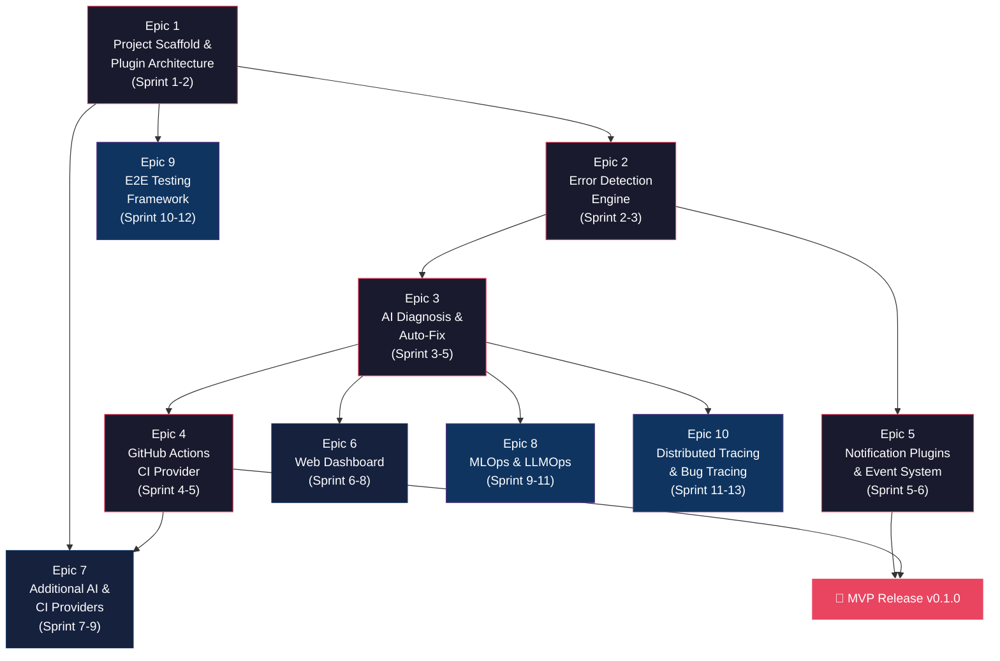

# Agent On the Fly — Epic Breakdown

> ## ⚠️ SCOPE-SHIFTED — REGENERATION REQUIRED
>
> **This document is OUT OF DATE against canonical [PRD v2.0](./PRD.md) (restored 2026-04-19).**
>
> This epic backlog was built against the narrower 69-FR Python-only scope (PRD v1.1, now deprecated). On 2026-04-19 the PRD was reconciled to its 99-FR Party-Mode scope. The following **critical coverage gaps** exist in this v1.1 breakdown:
>
> | PRD v2.0 scope | Covered in v1.1 epics? |
> |---|---|
> | FR-71–FR-75 — AI QA Agent (autonomous browser-driven, self-healing selectors, user-bug-report → regression test) | ❌ Missing — Epic 9 only covers YAML-based E2E |
> | FR-105 — Action-tier reversibility taxonomy (`READ`/`DRAFT`/`PROPOSE`/`EXECUTE_REVERSIBLE`/`EXECUTE_IRREVERSIBLE`) | ❌ Missing — foundational cross-cutting concern |
> | FR-106 — Production consent token with WebAuthn attestation | ❌ Missing |
> | FR-14 + J11 — Pre-push git hook + pre-push risk assessment | ❌ Missing (J11 Proactive Pre-Push Prevention journey absent) |
> | Telegram / claude-bridge integration (J1, J2, J6, J7, J8) | ❌ Missing — Epic 5 covers Console/Slack/Teams/Email only |
> | claude-bridge Goal Loop (J7) — multi-attempt remediation with worktree isolation + CI feedback | ❌ Missing |
> | AOTF MCP server (localhost-bound, auth-token-gated `fix` tool calls) | ❌ Missing |
> | Rust + TypeScript/Bun stack (Ratatui TUI, cargo+bun pipelines, Rust orchestrator FFI) | ❌ Every story assumes Python |
> | Strengthened FR-66 — audit log with approver/timestamp/reason (min 20 chars) + token hash + WebAuthn assertion hash on `EXECUTE_IRREVERSIBLE` | ⚠ Partial (Story 6.7 covers schema but not WebAuthn-hash field) |
> | Multi-language fix engine (TS/JS, Python, Go, Rust, Java/Kotlin, Ruby from v1.0) | ❌ Missing |
>
> **Additionally, the pre-existing V-1 sequencing defect is unchanged:** Story 4.7 (Git Failure Mode Handling) is needed throughout Epic 3's Auto-Fix Safety stories (3.11–3.13) but is scheduled later. See [`_bmad-output/planning-artifacts/implementation-readiness-report-2026-04-19.md`](../_bmad-output/planning-artifacts/implementation-readiness-report-2026-04-19.md) §5.
>
> **Estimated regeneration delta:** ~30-40 new stories (~150-200 additional points) for the missing scope; stack retargeting touches all 75 existing stories; Epic 7 should split per readiness report §5.1.
>
> **Next step:** invoke `bmad-create-epics-and-stories` skill in a fresh session **after** architecture has been regenerated against PRD v2.0. Do not attempt sprint planning from this breakdown until regenerated.
>
> *(Scope-shift banner added 2026-04-19 during PRD v1.1 → v2.0 reconciliation.)*

---

**Author:** hieutrungdao
**Date:** 2026-04-13 (body); scope-shift banner added 2026-04-19
**Version:** 1.1 (body) — **DEPRECATED pending regeneration to v2.0**
**Status:** Draft — OUT OF DATE

### Changelog

- **1.2 (2026-04-19)** — Scope-shift banner added enumerating the 10+ PRD v2.0 features not covered in this v1.1 breakdown. Body unchanged; no stories added/removed. Regeneration required.
- **1.1 (2026-04-13)** — Aligned with Architecture v1.1 and PRD v1.1: added stories for Plugin Security (Epic 1), Polling Watcher abstraction (Epic 2), CLIAgentBackendBase + Context Window Management + Auto-Fix Safety Model (Epic 3), Git Failure Mode Handling (Epic 4), token-based multi-user dashboard auth + audit log (Epic 6), Codex CLI / OpenCode CLI agent backends + polling watcher implementations (Epic 7). Updated story points and FR Coverage Verification.
- **1.0 (2026-04-04)** — Initial draft.

---

## Overview

This document breaks down the AOTF product requirements into 10 epics spanning 3 phases: MVP (Epics 1-5), Growth (Epics 6-7), and Vision (Epics 8-10). Each epic contains user stories with acceptance criteria, estimated story points, and sprint allocation.

**Total Scope:** 10 epics, 75 stories, ~26 weeks (Architecture v1.1 expanded MVP scope by ~+90 story points across Epics 1, 2, 3, 4 to cover Plugin Security, Polling Watcher abstraction, CLI Agent abstraction, Context Window Management, Auto-Fix Safety Model, Git Failure Mode Handling)

---

## Dependency Graph

---

## Sprint Allocation Summary

| Sprint | Weeks | Epics | Story Points | Milestone |
|---|---|---|---|---|
| 1-2 | Weeks 1-4 | Epic 1 (47 pts) | 47 | Foundation complete, plugin system + security working |
| 2-3 | Weeks 3-6 | Epic 2 (50 pts) | 50 | Error detection working end-to-end (streaming + polling abstraction) |
| 3-6 | Weeks 5-12 | Epic 3 (92 pts) | 92 | AI diagnosis + auto-fix working with full Safety Model |
| 5-6 | Weeks 9-12 | Epic 4 (38 pts) | 38 | GitHub Actions integration + Git Failure Mode handling |
| 6-7 | Weeks 11-14 | Epic 5 (30 pts) | 30 | **MVP Release v0.1.0** |
| 7-9 | Weeks 13-18 | Epic 6 (45 pts) | 45 | Web dashboard with multi-user auth + audit log |
| 9-12 | Weeks 17-24 | Epic 7 (70 pts) | 70 | Multi-provider support + polling watchers + additional CLI agents |
| 12-14 | Weeks 23-28 | Epic 8 (40 pts) | 40 | MLOps/LLMOps features |
| 13-15 | Weeks 25-30 | Epic 9 (30 pts) | 30 | E2E testing framework |
| 14-16 | Weeks 27-32 | Epic 10 (28 pts) | 28 | Distributed tracing |

**Note (v1.1):** MVP critical path expanded from ~12 weeks to ~14 weeks due to Plugin Security (Epic 1), Polling Watcher abstraction (Epic 2), Auto-Fix Safety Model (Epic 3), and Git Failure Mode Handling (Epic 4) work. Total project scope ~32 weeks vs the v1.0 ~26 weeks. Decision rationale: shipping MVP without these would create production incidents that erode the trust the product depends on.

---

## Phase 1: MVP (Epics 1-5)

---

### Epic 1: Project Scaffold & Plugin Architecture

**Goal:** Establish repository structure, CLI skeleton, configuration system, and plugin registry.

**FR Coverage:** FR-01, FR-02, FR-03, FR-04, FR-49, FR-50, FR-51
**Story Points:** 47
**Sprint:** 1-2

**Risk:**
| Risk | Likelihood | Impact | Mitigation |
|---|---|---|---|
| Plugin API design instability | Medium | High | Design ABCs with real plugin implementations in mind; freeze after Epic 4 validates |
| Config complexity | Low | Medium | Start with YAML-only; add env var override in iteration |

#### Stories

**Story 1.1: Initialize Python project with pyproject.toml and CLI entry point**
- **Points:** 5
- **Description:** Set up repository with `src/aotf/` layout, pyproject.toml with metadata and dependencies, Click CLI entry point, and basic `aotf --version` command.
- **Acceptance Criteria:**
  - Given a fresh clone, when `pip install -e .` is run, then `aotf --version` prints the version
  - Given pyproject.toml, when inspected, then it has correct metadata, Python 3.11+ requirement, and all core dependencies
  - Given the project root, when `pytest` is run, then the test suite executes (even if empty)

**Story 1.2: Implement configuration system**
- **Points:** 8
- **Description:** Create Pydantic v2 settings class that loads from `.aotf/config.yaml`, environment variables (`AOTF_*` prefix), and CLI flag overrides. Include defaults for all settings.
- **Acceptance Criteria:**
  - Given no config file, when AOTF starts, then sensible defaults are used
  - Given `.aotf/config.yaml` with custom values, when AOTF starts, then config file values override defaults
  - Given `AOTF_WATCH__POLL_INTERVAL=60`, when AOTF starts, then env var overrides config file value
  - Given invalid config values, when AOTF starts, then clear validation error is shown

**Story 1.3: Implement plugin registry with entry_points discovery**
- **Points:** 8
- **Description:** Create plugin registry that discovers plugins via `importlib.metadata.entry_points()` for groups `aotf.ai_backends`, `aotf.ci_providers`, `aotf.notifications`, `aotf.watchers`. Also scan `.aotf/plugins/` directory for local plugins.
- **Acceptance Criteria:**
  - Given a package with `aotf.ai_backends` entry point installed, when `aotf plugin list` is run, then the plugin appears
  - Given a Python file in `.aotf/plugins/`, when AOTF starts, then the local plugin is discovered
  - Given a plugin that fails to load, when discovery runs, then error is logged but other plugins still load

**Story 1.4: Define abstract base classes for all plugin types**
- **Points:** 10
- **Description:** Create ABCs: `AIBackendABC` + `CLIAgentBackendBase` (subprocess CLI agent shared base), `CIProviderABC`, `NotificationChannelABC`, `LogWatcherABC` + `StreamingLogWatcherABC` + `PollingLogWatcherABC` (with `WatcherCursor`), `ErrorDetectorABC`, `RepositoryABC`. Include full type hints, docstrings, and dataclass definitions for all input/output types (`DiagnosisContext`, `DiagnosisResult`, `FixSuggestion` with `estimated_blast_radius`, `AgentEvent`, `TokenBudget`, `WatcherCursor`).
- **Acceptance Criteria:**
  - Given each ABC, when inspected, then all abstract methods have type hints and docstrings
  - Given `CLIAgentBackendBase`, when subclassed, then only `build_command()`, `parse_event()`, `extract_result()` need overriding — subprocess lifecycle, timeout, and stream handling are inherited
  - Given `StreamingLogWatcherABC` and `PollingLogWatcherABC`, when implemented, then both share the `LogWatcherABC` health/start/stop contract but use distinct yield mechanisms (`stream()` vs `query(since, until)`)
  - Given a class that implements an ABC, when it misses a method, then Python raises TypeError at import time
  - Given the dataclasses, when instantiated with invalid fields, then Pydantic validation runs and surfaces clear errors

**Story 1.5: Set up testing infrastructure**
- **Points:** 3
- **Description:** Configure pytest with pytest-asyncio, create conftest.py with shared fixtures (temp config, mock plugins, in-memory SQLite), add GitHub Actions CI workflow.
- **Acceptance Criteria:**
  - Given the test suite, when `pytest` runs, then async tests execute correctly
  - Given a PR to the repo, when pushed, then GitHub Actions runs tests and linting
  - Given mock plugin fixtures, when used in tests, then they implement all ABCs correctly

**Story 1.6: Create `aotf init` command**
- **Points:** 2
- **Description:** Implement `aotf init` that scans the current directory for project indicators (Docker files, log directories, CI configs) and creates `.aotf/config.yaml` with sensible defaults. Add `.aotf/` to .gitignore if not present, but **keep `.aotf/plugins.lock.yaml` checked in** (per Plugin Security model).
- **Acceptance Criteria:**
  - Given a project with docker-compose.yml, when `aotf init` runs, then config includes Docker container watching
  - Given a project with `.github/workflows/`, when `aotf init` runs, then config sets ci_provider to github
  - Given an existing `.aotf/config.yaml`, when `aotf init` runs, then user is prompted before overwriting
  - Given `.gitignore` is updated, when inspected, then `plugins.lock.yaml` is explicitly un-ignored

**Story 1.7: Implement Plugin Security (allowlist + checksum + capability scoping)**
- **Points:** 13
- **Description:** Three layers of plugin trust enforcement:
  1. **Lockfile** — `aotf plugin install <name>` writes `.aotf/plugins.lock.yaml` with `version`, `sha256`, `source`, and `capabilities`. `aotf plugin trust <name>` is the explicit user gesture to grant declared capabilities. Discovery skips entry-point plugins absent from the lockfile and logs a warning.
  2. **Checksum verification** — On load, validator computes SHA-256 of the resolved entry-point module file (and wheel for entry-point installs) and compares to the lockfile entry. Mismatch raises `PluginIntegrityError` and refuses to load.
  3. **Capability scoping** — Plugins declare required capabilities (`watcher`, `ai_backend`, `ci_provider`, `notifications`, `storage`, `network.outbound`, `git.write`, `subprocess`) in their `pyproject.toml` `[tool.aotf.plugin]` table. Lifecycle manager wraps plugin entry points with capability checks via a lightweight import-hook that intercepts modules for shell invocation, raw sockets, and process spawning. A plugin declared as `notifications` only that attempts to spawn a child process raises `PluginCapabilityViolation`.
- **Acceptance Criteria:**
  - Given a plugin discovered via entry point but absent from `.aotf/plugins.lock.yaml`, when load is attempted, then load is skipped and a structured warning is logged
  - Given a plugin file modified after lockfile generation, when load is attempted, then `PluginIntegrityError` is raised with both expected and actual SHA-256
  - Given a plugin declared with capabilities `[notifications]` that attempts to spawn a subprocess, when the call is made, then `PluginCapabilityViolation` is raised with the offending capability name
  - Given `aotf plugin trust <name>`, when run, then user is shown the plugin's declared capabilities and asked to confirm before lockfile is updated
  - Given `aotf plugin install <name>`, when run, then plugin is fetched, SHA-256 computed, and `plugins.lock.yaml` updated atomically

---

### Epic 2: Error Detection Engine

**Goal:** Watch log sources, detect errors via configurable regex, deduplicate, store events, and notify.

**FR Coverage:** FR-05, FR-06, FR-07, FR-08, FR-09, FR-10, FR-52, FR-53
**Story Points:** 50
**Sprint:** 2-3

**Risk:**
| Risk | Likelihood | Impact | Mitigation |
|---|---|---|---|
| Cross-platform file watching | Medium | Medium | Use watchdog library; test on Linux + macOS |
| Docker socket permissions | Medium | Low | Clear error message with fix instructions; graceful fallback |
| High log volume causing backpressure | Low | High | Async queues with bounded size; drop oldest on overflow |

#### Stories

**Story 2.1: Implement file-tail log watcher (StreamingLogWatcherABC)**
- **Points:** 5
- **Description:** Create `FileTailWatcher` implementing `StreamingLogWatcherABC` using the watchdog library. Handle file rotation (detect truncation or rename), support glob patterns for file paths, and yield `LogLine` objects with metadata via `stream()`.
- **Acceptance Criteria:**
  - Given a log file, when new lines are appended, then watcher yields them within 1 second
  - Given a file that is rotated (renamed + new file created), when rotation occurs, then watcher follows the new file
  - Given a glob pattern `*.log`, when multiple files match, then all are watched simultaneously

**Story 2.2: Implement Docker container log watcher (StreamingLogWatcherABC)**
- **Points:** 8
- **Description:** Create `DockerLogWatcher` implementing `StreamingLogWatcherABC` using Docker SDK to stream logs from containers matching configurable name patterns. Extracted from CICD `docker_status.py` container monitoring. Handle container restart gracefully.
- **Acceptance Criteria:**
  - Given running Docker containers matching pattern, when logs are emitted, then watcher yields LogLine objects
  - Given a container that restarts, when restart completes, then watcher reconnects to log stream
  - Given no Docker daemon available, when watcher starts, then clear error message is shown

**Story 2.3: Implement regex-based error detector**
- **Points:** 5
- **Description:** Create `RegexErrorDetector` with configurable patterns and sensible defaults. Extracted from CICD watchdog regex patterns. Include defaults for: Python tracebacks, HTTP 5xx, Java exceptions, Node.js errors, CRITICAL/FATAL/PANIC/OOMKilled.
- **Acceptance Criteria:**
  - Given a log line matching a default pattern (e.g., "HTTP 500"), when processed, then DetectedError is created
  - Given a custom pattern in config, when a matching line appears, then it is detected
  - Given a non-matching line, when processed, then no error is created

**Story 2.4: Implement error deduplication**
- **Points:** 5
- **Description:** Create `Deduplicator` using content hashing (SHA256 of normalized error message) with configurable TTL. Extracted from CICD `_seen_error_hashes` pattern.
- **Acceptance Criteria:**
  - Given the same error occurring twice within TTL, when processed, then second occurrence is marked as duplicate
  - Given the same error after TTL expires, when processed, then it is treated as new
  - Given different errors with similar messages, when processed, then each is treated as unique

**Story 2.5: Implement SQLite storage for errors**
- **Points:** 5
- **Description:** Create `SQLiteRepository` implementing `RepositoryABC` with tables for errors, diagnoses, and fixes. Include automatic schema migration on startup and configurable retention (default 30 days).
- **Acceptance Criteria:**
  - Given a fresh database, when AOTF starts, then schema is created automatically
  - Given stored errors older than retention period, when cleanup runs, then expired errors are removed
  - Given 10,000+ stored errors, when `list_errors` is called with filters, then response is <100ms

**Story 2.6: Implement `aotf watch` daemon command**
- **Points:** 5
- **Description:** Create daemon mode that starts all configured watchers, runs detection loop, stores errors, and dispatches notifications. Support foreground mode (default) and background mode (`--daemon` flag). Handle SIGINT/SIGTERM for graceful shutdown.
- **Acceptance Criteria:**
  - Given configured log sources, when `aotf watch` starts, then all watchers begin monitoring
  - Given a detected error, when stored, then notification is dispatched to configured channels
  - Given SIGINT (Ctrl+C), when received, then daemon shuts down gracefully within 5 seconds

**Story 2.7: Implement `aotf errors list` command**
- **Points:** 5
- **Description:** Create CLI command to query and display error history with Rich-formatted tables. Support filters: `--service`, `--severity`, `--since`, `--until`, `--status`, `--limit`.
- **Acceptance Criteria:**
  - Given stored errors, when `aotf errors list` runs, then errors display in a formatted table
  - Given `--service api`, when filtered, then only api-service errors appear
  - Given `--since 1h`, when filtered, then only errors from the last hour appear

**Story 2.8: Implement rate-limited notification dispatch**
- **Points:** 4
- **Description:** Create `RateLimiter` and `NotificationRouter` that dispatch error events to configured channels while respecting per-channel rate limits. Rate limiter sits **only on the notify path** — storage subscribers receive every event from the bus unfiltered. Extracted from CICD watchdog rate limiting.
- **Acceptance Criteria:**
  - Given rate limit of 5/hour, when 10 errors occur in 1 hour, then only 5 notifications are sent **and all 10 are stored**
  - Given multiple channels configured, when error occurs, then all channels receive notification (subject to each channel's own limit)
  - Given a channel that fails to send, when error occurs, then other channels still receive notification

**Story 2.9: Implement polling watcher abstraction (`PollingLogWatcherABC` + cursor persistence)**
- **Points:** 8
- **Description:** Create the `PollingLogWatcherABC` and `WatcherCursor` infrastructure that all polling watcher plugins (Loki, Grafana, Datadog, CloudWatch, Elasticsearch — implemented in Epic 7) will inherit from. Includes:
  - `PollingLogWatcherABC.query(since, until) -> AsyncIterator[LogLine]` and `cursor() -> WatcherCursor`
  - `WatcherCursor` dataclass: `(end_timestamp, last_id)` for resume-without-duplicates
  - `WatcherCursorRepo` (storage layer) — persisted cursor per `(source_name, watcher_name)` keypair
  - `WatcherManager` extension to schedule polling watchers on their declared `poll_interval` with backoff on failure and **backpressure** (pause polling when event bus is saturated above watermark)
  - In-process reference implementation (`InMemoryPollingWatcher`) for testing the abstraction without a real backend
- **Acceptance Criteria:**
  - Given `PollingLogWatcherABC.query(since, until)`, when called, then `LogLine` objects within the time range are yielded
  - Given a watcher that polled successfully and updated its cursor, when AOTF restarts, then `WatcherCursorRepo` resume picks up at the saved `(end_timestamp, last_id)` without re-emitting prior lines
  - Given event bus saturation above watermark, when scheduler ticks, then polling watchers skip their next query and log a backpressure event
  - Given a polling watcher that fails (timeout/HTTP error), when retried, then exponential backoff is applied and `WatcherHealth` reflects the failure
  - Given `InMemoryPollingWatcher` with seeded data, when integration test runs, then end-to-end flow (query → cursor → resume) is verified

---

### Epic 3: AI Diagnosis & Auto-Fix

**Goal:** AI-powered root cause analysis and automated fix creation with three remediation modes.

**FR Coverage:** FR-11, FR-12, FR-13, FR-14, FR-15, FR-16, FR-54, FR-56, FR-57, FR-58, FR-59, FR-60, FR-61
**Story Points:** 92
**Sprint:** 3-5

**Risk:**
| Risk | Likelihood | Impact | Mitigation |
|---|---|---|---|
| AI diagnosis quality varies | High | Medium | Confidence scoring; Approval Gate (Story 3.11) blocks low-confidence fixes from auto-applying |
| CLI agent (Claude/Codex/OpenCode) not installed | Medium | Low | Clear error message; `aotf doctor` command to check prerequisites; per-backend `cli_path` config |
| Large codebases exceed context window | High | High | `ContextBuilder` with layered token budget (Story 3.10); per-section caps; explicit `context_overflow` failure mode rather than silent truncation |
| AI generates broken/dangerous fix that passes CI | Medium | Critical | Five-gate Auto-Fix Safety Model (Story 3.11); Scope Limiter rejects oversized changes; protected-paths block migrations/infra/lockfiles by default |
| Concurrent fix operations race on same repo | Medium | High | Per-Repo Fix Mutex (Story 3.12) protects entire detect → apply → push sequence |
| Applied fix turns out to be wrong post-merge | Medium | High | Rollback Manager (Story 3.13) creates revert PR or deletes branch; `fix_rollback` table tracks pre-apply HEAD SHA |

#### Stories

**Story 3.1: Implement `ClaudeCodeBackend` (CLI agent — MVP default)**
- **Points:** 8
- **Description:** Create `ClaudeCodeBackend` inheriting `CLIAgentBackendBase` (Story 3.9). Wraps `claude` CLI with `--output-format stream-json --verbose --max-turns N`. Extracted and generalized from CICD `claude_executor.py`. Overrides `build_command()`, `parse_event()` (Claude Code's stream-json format → `AgentEvent`), and `extract_result()` (tool-call analysis → `DiagnosisResult` / `FixSuggestion`). Subprocess lifecycle, timeout, and stream handling are inherited.
- **Acceptance Criteria:**
  - Given `claude` CLI installed and on PATH, when `diagnose()` is called, then structured `DiagnosisResult` is returned with `tokens_used` populated
  - Given `claude` CLI not installed, when backend initializes, then clear error with install instructions and `aotf doctor` hint
  - Given a stream-json event sequence with tool calls (Edit, Read, Bash), when parsed, then `AgentEvent` objects are emitted in order and `extract_result()` produces the final structured output
  - Given a `DiagnosisResult`, when stored, then `backend_name="claude_code"` is recorded for audit/reproducibility

**Story 3.2: Implement prompt template system**
- **Points:** 5
- **Description:** Create Jinja2-based prompt templates for diagnosis and fix operations. Templates include: error context, relevant source file contents, recent git changes, project structure hints. Templates are customizable via `.aotf/templates/` directory.
- **Acceptance Criteria:**
  - Given an error with 3 relevant source files, when prompt is rendered, then all files are included with line numbers
  - Given custom templates in `.aotf/templates/`, when rendering, then custom templates override defaults
  - Given a rendered prompt, when inspected, then it is under the AI backend's context limit

**Story 3.3: Implement structured diagnosis output parser**
- **Points:** 5
- **Description:** Parse AI backend responses into `DiagnosisResult` dataclass. Extract: root cause description, affected file paths with line numbers, suggested fix description, confidence score (0-100), reasoning chain.
- **Acceptance Criteria:**
  - Given a well-formed AI response, when parsed, then all DiagnosisResult fields are populated
  - Given an ambiguous AI response, when parsed, then confidence score reflects uncertainty (<50)
  - Given a malformed AI response, when parsed, then graceful fallback with raw text in root_cause

**Story 3.4: Implement `aotf diagnose <error-id>` CLI command**
- **Points:** 5
- **Description:** CLI command that fetches error from storage, builds DiagnosisContext (error + source files + git history + log snippet), sends to AI backend, stores result, and displays formatted output.
- **Acceptance Criteria:**
  - Given a valid error ID, when diagnosed, then Rich-formatted diagnosis is displayed (root cause, files, confidence)
  - Given an invalid error ID, when attempted, then clear "error not found" message
  - Given diagnosis result, when stored, then it's linked to the original error

**Story 3.5: Implement git branch creation and code modification workflow**
- **Points:** 8
- **Description:** Create `GitOperations` class that handles: branch creation (`aotf/fix-<error-id>`), file modifications from FixSuggestion, commit with structured message, push to remote. All via subprocess git commands.
- **Acceptance Criteria:**
  - Given a FixSuggestion with file changes, when applied, then branch is created with correct name
  - Given changes, when committed, then commit message includes error ID and root cause summary
  - Given a branch, when pushed, then remote tracking is set up correctly

**Story 3.6: Implement `aotf fix <error-id>` CLI command with three modes**
- **Points:** 8
- **Description:** CLI command supporting `--mode diagnosis_only|fix_and_pr|full_auto`. In `diagnosis_only`: same as diagnose. In `fix_and_pr`: create branch + apply changes + create PR. In `full_auto`: create PR + wait for CI + auto-merge.
- **Acceptance Criteria:**
  - Given `--mode diagnosis_only`, when run, then only diagnosis output is shown (no code changes)
  - Given `--mode fix_and_pr`, when run, then branch is created and PR is opened
  - Given `--mode full_auto`, when CI fails, then PR is NOT merged and user is notified

**Story 3.7: Implement GitHub PR creation**
- **Points:** 8
- **Description:** Create PR via `gh` CLI or GitHub API. Include: structured title ("fix: 
"), body with diagnosis details, error context, confidence score. Support draft PRs and label configuration.
- **Acceptance Criteria:**
  - Given a pushed branch, when PR is created, then it has structured title and body
  - Given PR body, when inspected, then it includes error ID, root cause, confidence score, and affected files
  - Given `gh` CLI not authenticated, when PR creation fails, then clear error with auth instructions

**Story 3.8: Implement diagnosis and fix result storage**
- **Points:** 3
- **Description:** Extend SQLite schema with `diagnosis_results`, `fix_results`, `fix_locks`, `fix_rollback`, `audit_log` tables. Link to original errors. Include audit trail: timestamps, AI backend used, mode, success/failure, `tokens_used`, `estimated_blast_radius`, `confidence`.
- **Acceptance Criteria:**
  - Given a diagnosis, when stored, then it's queryable by error_id and includes `backend_name` and `tokens_used`
  - Given a fix result, when stored, then PR URL, CI status, `estimated_blast_radius`, and rollback reference are tracked
  - Given `aotf errors list`, when displayed, then diagnosis/fix status is shown per error

**Story 3.9: Implement `CLIAgentBackendBase` shared abstraction**
- **Points:** 8
- **Description:** Create the shared base class for all subprocess-wrapped CLI agent backends (Claude Code, Codex CLI in Epic 7, OpenCode in Epic 7). Handles:
  - Subprocess lifecycle (`asyncio.create_subprocess_exec` + clean shutdown on cancel/timeout)
  - Stream parsing pipeline: stdout line → `parse_event()` → `AgentEvent` → buffered list
  - Timeout enforcement with structured `BackendTimeoutError`
  - Environment injection (API keys, model selection)
  - `cli_path` resolution via PATH or per-backend `cli_path` config
  - Concrete `_run(mode, context)` that subclasses invoke from `diagnose()` / `suggest_fix()`
- **Acceptance Criteria:**
  - Given a subclass that overrides `build_command()`, `parse_event()`, `extract_result()`, when `diagnose()` is called, then base class handles spawn/stream/timeout uniformly
  - Given a CLI subprocess that exceeds `timeout_seconds`, when timeout fires, then process is terminated cleanly and `BackendTimeoutError` is raised with partial events captured
  - Given a CLI agent that emits malformed JSON, when `parse_event()` returns `None`, then the line is logged and parsing continues
  - Given `cli_path` not on PATH and not in config, when backend initializes, then clear error with install hint
  - Given `supports_agentic_fix() == True`, when checked by AI router, then router knows the backend can apply file changes itself

**Story 3.10: Implement Context Window Management (`ContextBuilder` + `TokenBudget`)**
- **Points:** 8
- **Description:** Build the layered token-budget system that prevents `DiagnosisContext` from overflowing the backend's `max_input_tokens`:
  - `TokenBudget` dataclass with per-section caps (error+log: 10%, git: 10%, source: 70%, system: 10%) and per-backend `max_input_tokens`
  - `ContextBuilder.build(error, source_files, git_history) -> DiagnosisContext` that:
    - Ranks source files by (a) appearance in error trace, (b) recent commits, (c) imports of (a)
    - Per-file budgeting; chunks large files around relevant symbols
    - Truncates log snippet to first/last N lines around match
    - Caps git history to most recent N commits; drops diffs, keeps messages + file lists
  - Explicit `context_overflow` failure: when budget cannot be met even after truncation, returns `DiagnosisResult` with `confidence=0` and `reasoning="context_overflow: needed N tokens, budget M"`. Never silently drops data.
  - Token counter — use `tiktoken` for OpenAI-compatible backends and per-CLI heuristic for CLI agents (count via dry-run when CLI exposes it).
- **Acceptance Criteria:**
  - Given an error with 50 source files referenced and a 200k-token backend, when context is built, then files are ranked and only enough fit within the source budget; rest are dropped with structured log
  - Given a context that cannot fit even after truncation, when `diagnose()` is called, then `DiagnosisResult(confidence=0, reasoning="context_overflow: ...")` is returned (no backend call)
  - Given different backends with different `max_input_tokens`, when context is built, then per-section caps scale proportionally

**Story 3.11: Implement Auto-Fix Safety Model — gates 1–3 (Approval / Dry-Run / Scope Limiter)**
- **Points:** 13
- **Description:** Three of the five safety gates that every fix passes through before reaching the CI provider:
  1. **Approval Gate** — Configurable thresholds: `safety.approval.required_below_confidence` (default 80) and `required_above_blast_radius` (default `medium`). For `fix_and_pr` mode: PR is created but not auto-merged (human reviews on GitHub). For `full_auto` mode: fix queues for dashboard approval. `aotf approve <fix_id>` is the explicit human gesture; surfaces in dashboard `/approvals`.
  2. **Dry-Run Renderer** — Always runs. Renders unified diff + written summary. Output stored on `FixResult.dry_run`. Requestable directly via `aotf fix <id> --dry-run` (skips application).
  3. **Scope Limiter** — Rejects fixes exceeding: `>10 files` OR `>500 lines` OR paths matching `safety.protected_paths` (default: `**/migrations/**`, `**/*.lock`, `infra/**`, `.github/workflows/**`) OR modifications to dependency files (`pyproject.toml`, `package.json`, `Pipfile`).
  Includes `BlastRadius` classifier (`low`/`medium`/`high`) computed from diff and surfaced on `FixSuggestion.estimated_blast_radius`.
- **Acceptance Criteria:**
  - Given a fix with confidence 75 in `full_auto` mode, when proposed, then it is queued for approval (not auto-applied); notification fires
  - Given `aotf fix <id> --dry-run`, when run, then unified diff + summary print and no branch is created
  - Given a fix that touches `infra/main.tf`, when scoped, then it is rejected with `ScopeLimitExceeded("protected_path: infra/")`
  - Given a fix touching 12 files, when scoped, then rejected with `ScopeLimitExceeded("max_files_changed: 12 > 10")`
  - Given `aotf approve <fix_id>` for a queued fix, when invoked by an `operator`-or-higher user, then fix proceeds through remaining gates

**Story 3.12: Implement Auto-Fix Safety Model — gate 4 (Per-Repo Fix Mutex)**
- **Points:** 5
- **Description:** SQLite-backed advisory lock that prevents concurrent fixes on the same repo from racing. Schema: `fix_locks(repo_root, holder_id, acquired_at, ttl)` with unique constraint on `repo_root`. Acquisition via `INSERT OR IGNORE`; release best-effort with TTL fallback (`fix.timeout_seconds + 60s`) for crash recovery. Mutex protects the entire **detect-source-state → apply → push** sequence — not just git operations — because two fixes targeting the same files would otherwise diverge in their working trees even if their pushes happened sequentially.
- **Acceptance Criteria:**
  - Given two `aotf fix` invocations against the same repo within 1 second, when both attempt acquisition, then one succeeds and the other queues (FIFO, with progress notification)
  - Given a fix worker that crashes mid-operation, when TTL expires, then the next fix request acquires the lock cleanly
  - Given the daemon and a CLI invocation racing on the same repo, when both attempt to fix, then the mutex serializes them across processes
  - Given `aotf fix status`, when run, then mutex holder + queue depth are surfaced

**Story 3.13: Implement Auto-Fix Safety Model — gate 5 (Rollback Manager)**
- **Points:** 5
- **Description:** Make every applied fix reversible. Pre-apply: record `(repo_root, fix_id, base_sha, base_branch, fix_branch, applied_at)` to `fix_rollback` table. Post-apply: store the resulting fix branch ref + PR URL. `aotf fix rollback <id>`:
  - If branch unmerged: delete the local + remote fix branch, close associated PR
  - If merged: create a revert PR titled `revert: <original fix title>` with original diagnosis + revert reason
  - Retain rollback records for `safety.rollback.retain_days` (default 30)
- **Acceptance Criteria:**
  - Given an unmerged fix, when `aotf fix rollback <id>` runs, then branch is deleted on local + remote and PR is closed
  - Given a merged fix, when `aotf fix rollback <id>` runs, then a revert PR is opened with original context preserved
  - Given a rollback record older than retention window, when cleanup runs, then it is purged
  - Given `aotf fix list --rollback-eligible`, when run, then all fixes within the retention window are listed

---

### Epic 4: GitHub Actions CI Provider Plugin

**Goal:** First CI provider plugin implementing full lifecycle; serves as reference implementation.

**FR Coverage:** FR-17, FR-18, FR-19, FR-62
**Story Points:** 38
**Sprint:** 4-5

**Risk:**
| Risk | Likelihood | Impact | Mitigation |
|---|---|---|---|
| GitHub API rate limiting | Medium | Low | Cache CI status checks; exponential backoff |
| `gh` CLI authentication complexity | Medium | Medium | Support both `gh` CLI and PAT token auth |

#### Stories

**Story 4.1: Implement GitHub Actions plugin — workflow detection**
- **Points:** 5
- **Description:** Parse `.github/workflows/*.yml` to detect existing CI configuration. Identify test jobs, build jobs, and deployment jobs. Provide `get_workflow_config()` implementation.
- **Acceptance Criteria:**
  - Given `.github/workflows/ci.yml`, when parsed, then test and build jobs are identified
  - Given no workflow files, when checked, then clear message about missing CI config

**Story 4.2: Implement PR creation via GitHub API**
- **Points:** 5
- **Description:** Implement `create_pr()` using `gh pr create` CLI or GitHub REST API via httpx. Support configurable base branch, labels, reviewers, and draft mode.
- **Acceptance Criteria:**
  - Given a pushed branch, when `create_pr()` is called, then PR is created on GitHub
  - Given configured reviewers, when PR is created, then reviewers are assigned
  - Given auth failure, when PR creation fails, then actionable error message is shown

**Story 4.3: Implement CI status monitoring**
- **Points:** 5
- **Description:** Implement `get_ci_status()` that polls GitHub PR check runs. Support configurable required checks list. Return structured `CIStatus` with per-check results.
- **Acceptance Criteria:**
  - Given a PR with running checks, when polled, then status returns "pending"
  - Given all required checks passed, when polled, then status returns "success"
  - Given any required check failed, when polled, then status returns "failure" with details

**Story 4.4: Implement auto-merge for full_auto mode**
- **Points:** 5
- **Description:** Implement `merge_pr()` with configurable policies: require CI pass, require N approvals, merge method (merge, squash, rebase). Only merge if all conditions are met.
- **Acceptance Criteria:**
  - Given CI passes and policies met, when merge is requested, then PR is merged
  - Given CI fails, when merge is requested, then merge is blocked with clear reason
  - Given insufficient approvals, when merge is requested, then merge is blocked

**Story 4.5: Create GitHub Actions reusable workflow for AOTF**
- **Points:** 5
- **Description:** Create a reusable GitHub Actions workflow that teams can reference to run AOTF as part of their CI. Supports: error scanning on push, auto-diagnosis on test failure, fix PR creation.
- **Acceptance Criteria:**
  - Given a repo referencing the reusable workflow, when a push triggers CI, then AOTF scans for errors
  - Given a test failure in CI, when AOTF runs, then diagnosis is created
  - Given workflow config, when customized, then fix_mode and AI backend are configurable

**Story 4.6: Write plugin development guide**
- **Points:** 5
- **Description:** Create `docs/plugin-guide.md` documenting the CI provider ABC contract, required methods, input/output types, testing patterns, the **Plugin Security model** (lockfile, capabilities, `aotf plugin trust`), and a step-by-step tutorial for creating a new CI provider plugin.
- **Acceptance Criteria:**
  - Given the guide, when a developer follows it, then they can create a working plugin in <4 hours
  - Given the guide, when inspected, then all ABC methods, capability declaration in `pyproject.toml`, and lockfile generation are documented with examples
  - Given the guide, when tested with a fresh developer, then no questions require reading source code

**Story 4.7: Implement Git Failure Mode Handling**
- **Points:** 8
- **Description:** Codify handling for every non-trivial `git` failure that subprocess git can encounter during fix application. All git invocations run with `GIT_TERMINAL_PROMPT=0` and `GIT_ASKPASS=echo` to fail fast on missing credentials. Per architecture §5 Git Failure Mode Handling table:
  - **Dirty working tree** on entry → refuse fix; return `GitStateError("dirty_tree", suggested_action="stash or commit")`
  - **Push rejected** (remote diverged) → fetch; rebase fix branch; retry push once; if still rejected, surface as `FixConflict` with diagnosis
  - **Merge conflict applying AI diff** → `git apply --check` fails; fall back to per-hunk apply; report `FixSuggestion.unapplied_hunks` for human review; never silently skip
  - **Source file changed since detection** → compare `error.git_sha` to `HEAD` per affected file; re-run diagnosis against current `HEAD` before applying; abort if root cause no longer reproduces
  - **Detached HEAD / non-default base branch** → refuse fix; require explicit `--base-branch` flag
  - **No credentials in non-interactive env** → detect via `GIT_TERMINAL_PROMPT=0`; surface `GitAuthError` immediately
  - **Branch already exists** (re-fix) → append short timestamp suffix: `aotf/fix-ERR-001-2026041315`
  Lives in `src/aotf/integration/git_ops.py` with errors in `git_errors.py`.
- **Acceptance Criteria:**
  - Given each of the 7 failure scenarios above, when triggered in an integration test, then the documented structured error or recovery path occurs
  - Given a push rejection, when retry+rebase succeeds, then push completes without operator intervention
  - Given source files changed since detection, when fix is requested, then re-diagnosis runs against current HEAD and aborts with clear message if root cause no longer reproduces
  - Given missing git credentials in CI, when push is attempted, then the process fails within 1 second (no hang) with `GitAuthError`

---

### Epic 5: Notification Plugins & Event System

**Goal:** Console, Slack, Teams, and email notification plugins with rate limiting and templates.

**FR Coverage:** FR-20, FR-21, FR-22, FR-23, FR-24, FR-25
**Story Points:** 30
**Sprint:** 5-6

**Milestone:** **MVP Release v0.1.0** upon completion

#### Stories

**Story 5.1: Implement console notification plugin**
- **Points:** 3
- **Description:** Default notification channel using Rich for formatted terminal output. Display error details with syntax highlighting, severity colors, and timestamps. Always enabled as fallback.
- **Acceptance Criteria:**
  - Given an error event, when console notifies, then Rich-formatted panel is displayed
  - Given a diagnosis result, when console notifies, then root cause and confidence are highlighted
  - Given no other channels configured, when error occurs, then console notification always fires

**Story 5.2: Implement Slack webhook notification plugin**
- **Points:** 5
- **Description:** Send structured messages to Slack via incoming webhook. Use Block Kit for rich formatting: error details, diagnosis summary, fix PR link, action buttons.
- **Acceptance Criteria:**
  - Given a valid webhook URL, when error occurs, then Slack message is sent with error context
  - Given a diagnosis result, when notified, then message includes root cause and confidence
  - Given webhook failure, when send fails, then error is logged and fallback to console

**Story 5.3: Implement MS Teams Adaptive Card notification plugin**
- **Points:** 5
- **Description:** Send Adaptive Cards via Power Automate webhook. Extracted from CICD `teams.py`. Include: error details, diagnosis summary, fix PR link, dashboard action button.
- **Acceptance Criteria:**
  - Given a valid Teams webhook, when error occurs, then Adaptive Card is sent
  - Given a fix PR created, when notified, then card includes PR link and CI status
  - Given card rendering, when inspected, then it matches CICD module card quality

**Story 5.4: Implement email SMTP notification plugin**
- **Points:** 5
- **Description:** Send HTML-formatted error reports via SMTP. Extracted from CICD `email.py`. Support: Gmail, custom SMTP servers, multiple recipients, TLS/STARTTLS.
- **Acceptance Criteria:**
  - Given valid SMTP config, when error occurs, then HTML email is sent to configured recipients
  - Given multiple recipients, when email is sent, then all recipients receive it
  - Given SMTP connection failure, when send fails, then error is logged with connection details

**Story 5.5: Implement notification rate limiting and aggregation**
- **Points:** 8
- **Description:** Rate limiter that throttles notifications per channel per time window. When rate limit is hit, aggregate suppressed notifications into a single summary. Extracted from CICD watchdog rate limiting.
- **Acceptance Criteria:**
  - Given 10 errors in 1 minute with limit of 5/hour, when processed, then 5 individual + 1 summary notification sent
  - Given different channels with different limits, when processed, then each channel respects its own limit
  - Given rate limit reset, when new window starts, then notifications resume normally

**Story 5.6: Implement notification template system**
- **Points:** 4
- **Description:** Jinja2-based templates for each notification type (error_detected, diagnosis_complete, fix_created, fix_merged). Templates are per-channel and customizable via `.aotf/templates/notifications/`.
- **Acceptance Criteria:**
  - Given default templates, when notification is sent, then it uses the channel-specific default
  - Given custom templates in `.aotf/templates/`, when notification is sent, then custom template is used
  - Given a template rendering error, when notification fires, then fallback to plain text

---

## Phase 2: Growth (Epics 6-7)

---

### Epic 6: Web Dashboard

**Goal:** Optional web UI for error monitoring, diagnosis viewing, and fix tracking.

**FR Coverage:** FR-26, FR-27, FR-28, FR-29, FR-30, FR-63, FR-64
**Story Points:** 45
**Sprint:** 6-8

#### Stories

**Story 6.1: Implement FastAPI server with SSE streaming**
- **Points:** 8
- **Description:** Create optional FastAPI application (installed via `aotf[dashboard]`) with SSE streaming for real-time updates. Connect to the same event bus used by the core engine.
- **Acceptance Criteria:**
  - Given `aotf dashboard` command, when run, then FastAPI server starts on configured port
  - Given SSE endpoint, when error occurs, then event is streamed to connected clients in <1 second
  - Given dashboard not installed, when `aotf dashboard` is run, then clear message about installing extra

**Story 6.2: Implement error timeline template**
- **Points:** 5
- **Description:** HTMX + Tailwind dark-theme template showing error timeline with real-time updates. Display: timestamp, service, severity, error message, diagnosis status, fix status.
- **Acceptance Criteria:**
  - Given stored errors, when dashboard loads, then error timeline is displayed
  - Given a new error, when detected, then timeline updates via SSE without page refresh
  - Given error filters, when applied, then timeline updates dynamically

**Story 6.3: Implement diagnosis result viewer**
- **Points:** 5
- **Description:** Structured display of diagnosis results: root cause panel, affected files with code snippets, confidence gauge, reasoning chain expandable section.
- **Acceptance Criteria:**
  - Given a diagnosed error, when clicked, then diagnosis detail view is shown
  - Given affected files, when displayed, then code snippets with line numbers are shown
  - Given confidence score, when displayed, then visual gauge (color-coded) is shown

**Story 6.4: Implement fix status tracker**
- **Points:** 5
- **Description:** Track fix lifecycle: PR created → CI running → CI passed/failed → merged/closed. Show PR link, CI check results, merge status.
- **Acceptance Criteria:**
  - Given a fix PR, when viewed, then all lifecycle stages are shown with timestamps
  - Given CI check results, when displayed, then pass/fail per check is shown
  - Given a merged PR, when viewed, then "fixed" badge is shown on the original error

**Story 6.5: Implement `aotf dashboard` CLI command**
- **Points:** 5
- **Description:** CLI command to launch dashboard server. Options: `--port`, `--host`, `--open` (auto-open browser). Support running alongside `aotf watch` or standalone.
- **Acceptance Criteria:**
  - Given `aotf dashboard --open`, when run, then server starts and browser opens
  - Given `aotf dashboard --port 9090`, when run, then server binds to port 9090
  - Given watch daemon already running, when dashboard starts, then it connects to the same data

**Story 6.6: Implement multi-user token-based dashboard authentication**
- **Points:** 8
- **Description:** Replace single-password auth with a per-user token model:
  - **Tokens** — Argon2id-hashed in storage; each token belongs to a user and carries scopes (`read`, `diagnose`, `fix.suggest`, `fix.apply`, `fix.merge`, `admin`)
  - **Roles** — `viewer` (read), `operator` (read + diagnose + fix.suggest), `maintainer` (all except admin), `admin` (user/token mgmt). Roles map to scope sets.
  - **Session cookies** — Short-lived (30 min) signed cookies refreshed on activity; absent activity expires → re-login
  - **CSRF** — All state-changing endpoints require CSRF token; cookies set `SameSite=Strict`
  - **Rate limiting** — Login attempts ≤5/min/IP; failed-token use ≤30/min/token
  - **Bootstrap** — On first run with no users, dashboard prints a one-time bootstrap admin token to stderr and refuses to start the HTTP server until the token is consumed to create a real admin
- **Acceptance Criteria:**
  - Given dashboard enabled with no users, when started, then bootstrap token is printed to stderr and HTTP listener does not bind
  - Given a `viewer` token, when fix-apply endpoint is called, then 403 with `insufficient_scope: fix.apply`
  - Given 6 failed login attempts in a minute from one IP, when 7th is attempted, then 429 with retry-after
  - Given a session cookie idle >30 min, when next request arrives, then re-login is required
  - Given a state-changing POST without CSRF token, when processed, then 403 with `csrf_missing`

**Story 6.7: Implement user/token management CLI + audit log**
- **Points:** 5
- **Description:** Two surfaces: `aotf user` commands and the `audit_log` table.
  - **CLI** — `aotf user create <name> --role <viewer|operator|maintainer|admin>` (emits token to stdout once), `aotf user list`, `aotf user revoke <name>`, `aotf user audit [--user] [--action] [--since]`
  - **Audit log** — Append-only `audit_log(timestamp, user, action, target, ip, user_agent, request_id)` table. Application layer never deletes; deletion requires direct DB access. Every state-changing action writes one row: token issuance/revoke, diagnosis trigger, fix apply, fix approve, merge, rollback.
  - **Dashboard view** — `/audit` shows reverse-chronological audit log with filters (user, action, time range), surfaced only to `admin` role
- **Acceptance Criteria:**
  - Given `aotf user create alice --role operator`, when run, then user is created and token is printed exactly once (cannot be retrieved later)
  - Given any state-changing action in the dashboard or via API, when executed, then a corresponding `audit_log` row is written before response is returned
  - Given `aotf user audit --user alice --since 24h`, when run, then alice's recent actions are listed with timestamps
  - Given a non-admin user, when `/audit` is requested, then 403
  - Given dashboard `/audit` view, when an admin filters by `action=fix.merge`, then only merge events appear

---

### Epic 7: Additional AI Backends & CI Providers

**Goal:** Expand plugin ecosystem beyond defaults.

**FR Coverage:** FR-31, FR-32, FR-33, FR-34, FR-35, FR-36, FR-55, FR-65, FR-66, FR-67, FR-68, FR-69
**Story Points:** 70
**Sprint:** 7-9

#### Stories

**Story 7.1: Implement OpenAI GPT backend plugin**
- **Points:** 5
- **Description:** AI backend using OpenAI API (GPT-4o, GPT-4-turbo). Implement `diagnose()` and `suggest_fix()` using chat completions with function calling for structured output.
- **Acceptance Criteria:**
  - Given valid OpenAI API key, when diagnosis runs, then structured DiagnosisResult is returned
  - Given configurable model selection, when specified, then the correct model is used
  - Given API rate limit hit, when retried, then exponential backoff is applied

**Story 7.2: Implement Google Gemini backend plugin**
- **Points:** 5
- **Description:** AI backend using Google Generative AI API (Gemini Pro, Gemini Ultra). Implement structured output via JSON mode.
- **Acceptance Criteria:**
  - Given valid Gemini API key, when diagnosis runs, then structured DiagnosisResult is returned
  - Given model selection, when specified, then correct Gemini model is used

**Story 7.3: Implement local model backend plugin**
- **Points:** 8
- **Description:** AI backend using Ollama or llama.cpp for fully offline operation. Support configurable model selection, context length, and quantization level. Document minimum model requirements for acceptable diagnosis quality.
- **Acceptance Criteria:**
  - Given Ollama running locally, when diagnosis runs, then local model produces DiagnosisResult
  - Given no Ollama installed, when backend initializes, then clear install instructions
  - Given model requirements, when documented, then minimum model size for quality threshold is stated

**Story 7.4: Implement GitLab CI provider plugin**
- **Points:** 5
- **Description:** CI provider using GitLab API for merge request creation, pipeline status monitoring, and auto-merge.
- **Acceptance Criteria:**
  - Given GitLab project, when fix runs, then merge request is created with structured description
  - Given pipeline status, when polled, then pass/fail is correctly reported
  - Given auto-merge, when CI passes, then MR is merged

**Story 7.5: Implement Azure DevOps CI provider plugin**
- **Points:** 8
- **Description:** CI provider using Azure DevOps REST API. Extracted from CICD `webhooks.py` Azure DevOps webhook parsing. Support pull request creation, build status, and completion policies.
- **Acceptance Criteria:**
  - Given Azure DevOps project, when fix runs, then PR is created with structured description
  - Given build pipeline, when polled, then status is correctly reported
  - Given auto-complete policy, when CI passes, then PR completes automatically

**Story 7.6: Implement Jenkins CI provider plugin**
- **Points:** 5
- **Description:** CI provider using Jenkins REST API. Support: triggering builds, polling build status, parameterized builds for fix verification.
- **Acceptance Criteria:**
  - Given Jenkins server, when fix branch is pushed, then build is triggered
  - Given build status, when polled, then pass/fail is correctly reported

**Story 7.7: Implement `CodexCLIBackend` (CLI agent)**
- **Points:** 5
- **Description:** Inherits `CLIAgentBackendBase` (Story 3.9). Wraps `codex` CLI. Overrides `build_command()` (Codex-specific flags), `parse_event()` (Codex event stream → `AgentEvent`), and `extract_result()`. Demonstrates that the CLI agent abstraction is real, not aspirational.
- **Acceptance Criteria:**
  - Given `codex` CLI installed, when `diagnose()` is called, then structured `DiagnosisResult` with `backend_name="codex_cli"` is returned
  - Given the same `DiagnosisContext` sent to `ClaudeCodeBackend` and `CodexCLIBackend`, when both run, then both produce a valid `DiagnosisResult` (content may differ)
  - Given a Codex event sequence with tool calls, when parsed, then `AgentEvent` objects are emitted in order

**Story 7.8: Implement `OpenCodeBackend` (CLI agent)**
- **Points:** 5
- **Description:** Inherits `CLIAgentBackendBase` (Story 3.9). Wraps `opencode` CLI; parses NDJSON event format. Same override surface as Codex: `build_command()`, `parse_event()`, `extract_result()`.
- **Acceptance Criteria:**
  - Given `opencode` CLI installed, when `diagnose()` is called, then structured `DiagnosisResult` with `backend_name="opencode"` is returned
  - Given OpenCode NDJSON event stream, when parsed line-by-line, then `AgentEvent` objects are emitted incrementally (no full-buffer parse required)
  - Given `opencode` CLI not installed, when backend initializes, then clear install instructions are surfaced

**Story 7.9: Implement Loki polling watcher plugin (reference implementation)**
- **Points:** 8
- **Description:** First polling watcher implementation, intended as the reference for plugin authors. Inherits `PollingLogWatcherABC` (Story 2.9). Uses Loki's `/loki/api/v1/query_range` with LogQL filters. Cursor = `(end_ts, last_id)` for resume-without-duplicates. Configurable `poll_interval`, LogQL query, label filters, and time window. Distributed via `aotf[loki]` extra.
- **Acceptance Criteria:**
  - Given a configured Loki endpoint and LogQL query, when `query(since, until)` runs, then matching `LogLine` objects are yielded
  - Given a Loki backend that returns paginated results, when more pages exist, then watcher fetches all pages within the time window
  - Given a watcher restart with persisted cursor, when resumed, then no duplicate lines are emitted at the boundary
  - Given Loki returns 5xx, when query fails, then exponential backoff is applied and `WatcherHealth` reflects the failure
  - Given the plugin is in `.aotf/plugins.lock.yaml` with capabilities `[watcher, network.outbound]`, when loaded, then capability enforcement allows network calls but blocks subprocess spawning

**Story 7.10: Implement Grafana, Datadog, CloudWatch, Elasticsearch polling watchers**
- **Points:** 8
- **Description:** Four additional polling watcher plugins, each shipped as its own optional extra:
  - **Grafana** (`aotf[grafana]`) — Grafana data source proxy; resolves data source by UID and delegates to underlying Loki/Elasticsearch query
  - **Datadog** (`aotf[datadog]`) — `/api/v2/logs/events` with cursor-based pagination
  - **CloudWatch** (`aotf[cloudwatch]`) — `FilterLogEvents` API with `nextToken` pagination
  - **Elasticsearch** (`aotf[elasticsearch]`) — `_search` with PIT + `search_after` for stable pagination across writes
  Each follows the Loki watcher (Story 7.9) pattern: cursor persistence, backoff, capability declaration. Each ships with integration tests against a recorded fixture (no live backend required for CI).
- **Acceptance Criteria:**
  - Given each watcher with configured credentials, when `query(since, until)` runs, then `LogLine` objects are yielded from the respective backend
  - Given each watcher restart with persisted cursor, when resumed, then no duplicate lines are emitted
  - Given each plugin's lockfile entry with declared capabilities, when loaded, then capability enforcement is honored
  - Given each plugin, when documented in `docs/plugin-guide.md`, then setup steps + minimal config example are present

---

## Phase 3: Vision (Epics 8-10)

---

### Epic 8: MLOps & LLMOps Integration

**Goal:** Model monitoring, experiment tracking integration, and prompt versioning.

**FR Coverage:** FR-37, FR-38, FR-39, FR-40, FR-41
**Story Points:** 40
**Sprint:** 9-11

#### Stories

**Story 8.1: Implement model metrics collector**
- **Points:** 8
- **Description:** Collect model performance metrics (accuracy, latency, throughput, error rate) from structured log sources. Support configurable metric patterns and aggregation windows.
- **Acceptance Criteria:**
  - Given model serving logs with metrics, when collected, then time-series data is stored
  - Given configurable metric patterns, when customized, then new metrics are tracked
  - Given aggregation window (1h, 24h), when queried, then aggregated stats are returned

**Story 8.2: Implement data drift detection**
- **Points:** 8
- **Description:** Statistical tests on feature distributions to detect data drift. Support: KL divergence, Kolmogorov-Smirnov test, Population Stability Index (PSI). Configurable thresholds and alert triggers.
- **Acceptance Criteria:**
  - Given baseline feature distribution, when new data deviates significantly, then drift alert is triggered
  - Given configurable threshold, when set, then alerts fire only above threshold
  - Given drift detected, when AI diagnoses, then root cause traces to data pipeline changes

**Story 8.3: Implement MLflow integration plugin**
- **Points:** 5
- **Description:** Connect to MLflow tracking server to correlate experiments with production metrics. Link model versions to deployment events. Support experiment comparison.
- **Acceptance Criteria:**
  - Given MLflow server, when model version changes, then AOTF tracks the deployment
  - Given production drift, when diagnosed, then relevant MLflow experiments are referenced

**Story 8.4: Implement Weights & Biases integration plugin**
- **Points:** 5
- **Description:** Connect to W&B for experiment tracking correlation. Support run comparison and artifact linking.
- **Acceptance Criteria:**
  - Given W&B project, when model metrics change, then relevant W&B runs are correlated

**Story 8.5: Implement LLM prompt versioning tracker**
- **Points:** 8
- **Description:** Git-based tracking of prompt template files. Detect prompt changes, version them, and correlate with output quality metrics. Support `.prompt` and `.jinja2` file watching.
- **Acceptance Criteria:**
  - Given prompt files in git, when changed, then version is tracked with diff
  - Given prompt version change, when correlated with quality metrics, then impact is shown
  - Given `aotf prompts history`, when run, then version timeline with quality correlation is displayed

**Story 8.6: Implement prompt quality correlation**
- **Points:** 6
- **Description:** Track prompt version changes vs output quality metrics (response quality, latency, cost, error rate). Identify which prompt changes improved or degraded quality.
- **Acceptance Criteria:**
  - Given prompt change and quality metrics, when correlated, then improvement/degradation is flagged
  - Given multiple prompt versions, when compared, then quality trend is shown
  - Given degradation detected, when alerted, then previous prompt version is suggested for rollback

---

### Epic 9: E2E Testing Framework

**Goal:** Automated end-to-end test execution triggered by deployments.

**FR Coverage:** FR-42, FR-43, FR-44, FR-45
**Story Points:** 30
**Sprint:** 10-12

#### Stories

**Story 9.1: Implement YAML-based test suite definition**
- **Points:** 5
- **Description:** Define E2E test suites in `.aotf/tests/` using YAML format. Support: test name, runner (playwright/cypress/selenium), URL, steps, expected outcomes, timeout.
- **Acceptance Criteria:**
  - Given a YAML test file, when parsed, then test definition is validated
  - Given invalid YAML, when parsed, then clear validation error is shown
  - Given test suites, when listed via `aotf test list`, then all suites are shown

**Story 9.2: Implement test runner abstraction**
- **Points:** 8
- **Description:** Plugin-based test runner supporting Playwright, Cypress, and Selenium. ABC with `run_test()`, `get_results()`, `take_screenshot()` methods.
- **Acceptance Criteria:**
  - Given Playwright runner, when test runs, then results include pass/fail + screenshots
  - Given Cypress runner, when test runs, then results include pass/fail + video
  - Given runner not installed, when test runs, then clear install instructions

**Story 9.3: Implement deploy trigger integration**
- **Points:** 5
- **Description:** Watch for successful deployment events (via CI provider webhook or log detection) and auto-trigger configured E2E test suites.
- **Acceptance Criteria:**
  - Given successful deployment, when detected, then E2E tests auto-run
  - Given test failure after deploy, when detected, then notification includes deploy context
  - Given configurable trigger rules, when set, then only matching deployments trigger tests

**Story 9.4: Implement AI-powered test failure analysis**
- **Points:** 8
- **Description:** Use AI backend to analyze E2E test failures. Categorize failures: real bug, flaky test, environment issue, timing issue. Detect flakiness patterns across multiple runs.
- **Acceptance Criteria:**
  - Given a test failure, when analyzed, then category is assigned (bug/flaky/env/timing)
  - Given repeated failures of same test, when analyzed, then flakiness score is calculated
  - Given real bug detected, when analyzed, then root cause diagnosis is triggered

**Story 9.5: Implement `aotf test run <suite>` CLI command**
- **Points:** 4
- **Description:** CLI command to run a specific test suite or all suites. Display results with Rich formatting: pass/fail per test, screenshots for failures, overall summary.
- **Acceptance Criteria:**
  - Given a test suite, when `aotf test run smoke` runs, then all tests in suite execute
  - Given test failures, when displayed, then failure details and screenshots are shown
  - Given all tests pass, when displayed, then green summary with timing is shown

---

### Epic 10: Distributed Tracing & Bug Tracing

**Goal:** Trace errors and bugs across distributed microservices.

**FR Coverage:** FR-46, FR-47, FR-48
**Story Points:** 28
**Sprint:** 11-13

#### Stories

**Story 10.1: Implement OpenTelemetry trace correlation**
- **Points:** 8
- **Description:** Link detected errors to OpenTelemetry traces. Parse trace IDs from log lines, fetch trace data from OTLP-compatible backends (Jaeger, Zipkin, Tempo). Show full request path for errors.
- **Acceptance Criteria:**
  - Given error with trace ID in log, when correlated, then full trace spans are retrieved
  - Given trace data, when displayed, then request path across services is shown
  - Given multiple OTLP backends, when configured, then correct backend is queried

**Story 10.2: Implement cross-service error graph**
- **Points:** 8
- **Description:** Build a graph of error propagation across services. Detect cascade patterns: when service A errors cause service B timeouts which cause service C failures. Visualize in CLI and dashboard.
- **Acceptance Criteria:**
  - Given errors across 3 services, when correlated, then cascade chain is identified
  - Given error graph, when displayed in CLI, then Rich tree/graph shows the cascade
  - Given error graph, when displayed in dashboard, then Mermaid diagram shows relationships

**Story 10.3: Implement `aotf trace <error-id>` command**
- **Points:** 8
- **Description:** CLI command for distributed root-cause analysis. Combines error context, trace data, cross-service graph, and AI diagnosis to identify the true origin of a cascading failure.
- **Acceptance Criteria:**
  - Given a cascading error, when traced, then origin service and root cause are identified
  - Given trace data, when displayed, then full request path with timing is shown
  - Given AI diagnosis, when combined with trace, then root cause includes service interaction context

**Story 10.4: Implement service dependency map generation**
- **Points:** 4
- **Description:** Auto-generate service dependency map from observed trace data. Identify: synchronous calls, async events, database dependencies, external API calls. Export as Mermaid diagram.
- **Acceptance Criteria:**
  - Given trace data from multiple services, when analyzed, then dependency map is generated
  - Given dependency map, when exported, then valid Mermaid diagram is produced
  - Given `aotf services map`, when run, then Rich-formatted dependency tree is displayed

---

## FR Coverage Verification

| FR | Epic | Story | Status |
|---|---|---|---|
| FR-01 | Epic 1 | Story 1.1 | Covered |
| FR-02 | Epic 1 | Story 1.6 | Covered |
| FR-03 | Epic 1 | Story 1.3 | Covered |
| FR-04 | Epic 1 | Story 1.4 | Covered |
| FR-05 | Epic 2 | Stories 2.1, 2.2 | Covered |
| FR-06 | Epic 2 | Story 2.3 | Covered |
| FR-07 | Epic 2 | Story 2.4 | Covered |
| FR-08 | Epic 2 | Story 2.6 | Covered |
| FR-09 | Epic 2 | Story 2.7 | Covered |
| FR-10 | Epic 2 | Story 2.8 | Covered |
| FR-11 | Epic 3 | Story 3.4 | Covered |
| FR-12 | Epic 3 | Story 3.3 | Covered |
| FR-13 | Epic 3 | Story 3.6 | Covered |
| FR-14 | Epic 3 | Story 3.6 | Covered |
| FR-15 | Epic 3 | Story 3.8 | Covered |
| FR-16 | Epic 3 | Story 3.1 | Covered |
| FR-17 | Epic 4 | Stories 4.1-4.3 | Covered |
| FR-18 | Epic 4 | Story 4.4 | Covered |
| FR-19 | Epic 4 | Story 4.5 | Covered |
| FR-20 | Epic 5 | Story 5.1 | Covered |
| FR-21 | Epic 5 | Story 5.2 | Covered |
| FR-22 | Epic 5 | Story 5.3 | Covered |
| FR-23 | Epic 5 | Story 5.4 | Covered |
| FR-24 | Epic 5 | Story 5.5 | Covered |
| FR-25 | Epic 5 | Story 5.6 | Covered |
| FR-26 | Epic 6 | Story 6.1 | Covered |
| FR-27 | Epic 6 | Story 6.3 | Covered |
| FR-28 | Epic 6 | Story 6.4 | Covered |
| FR-29 | Epic 6 | Story 6.5 | Covered |
| FR-30 | Epic 6 | Story 6.6 | Covered |
| FR-31 | Epic 7 | Story 7.1 | Covered |
| FR-32 | Epic 7 | Story 7.2 | Covered |
| FR-33 | Epic 7 | Story 7.3 | Covered |
| FR-34 | Epic 7 | Story 7.4 | Covered |
| FR-35 | Epic 7 | Story 7.5 | Covered |
| FR-36 | Epic 7 | Story 7.6 | Covered |
| FR-37 | Epic 8 | Story 8.1 | Covered |
| FR-38 | Epic 8 | Story 8.2 | Covered |
| FR-39 | Epic 8 | Story 8.3 | Covered |
| FR-40 | Epic 8 | Story 8.5 | Covered |
| FR-41 | Epic 8 | Story 8.6 | Covered |
| FR-42 | Epic 9 | Story 9.1 | Covered |
| FR-43 | Epic 9 | Story 9.2 | Covered |
| FR-44 | Epic 9 | Story 9.3 | Covered |
| FR-45 | Epic 9 | Story 9.4 | Covered |
| FR-46 | Epic 10 | Story 10.1 | Covered |
| FR-47 | Epic 10 | Story 10.2 | Covered |
| FR-48 | Epic 10 | Story 10.3 | Covered |
| FR-49 | Epic 1 | Story 1.7 | Covered |
| FR-50 | Epic 1 | Story 1.7 | Covered |
| FR-51 | Epic 1 | Story 1.7 | Covered |
| FR-52 | Epic 2 | Story 2.9 | Covered |
| FR-53 | Epic 2 | Story 2.9 | Covered |
| FR-54 | Epic 3 | Story 3.9 | Covered |
| FR-55 | Epic 7 | Stories 7.7, 7.8 | Covered |
| FR-56 | Epic 3 | Story 3.10 | Covered |
| FR-57 | Epic 3 | Story 3.11 | Covered |
| FR-58 | Epic 3 | Story 3.11 | Covered |
| FR-59 | Epic 3 | Story 3.11 | Covered |
| FR-60 | Epic 3 | Story 3.12 | Covered |
| FR-61 | Epic 3 | Story 3.13 | Covered |
| FR-62 | Epic 4 | Story 4.7 | Covered |
| FR-63 | Epic 6 | Story 6.7 | Covered |
| FR-64 | Epic 6 | Story 6.7 | Covered |
| FR-65 | Epic 7 | Story 7.9 | Covered |
| FR-66 | Epic 7 | Story 7.10 | Covered |
| FR-67 | Epic 7 | Story 7.10 | Covered |
| FR-68 | Epic 7 | Story 7.10 | Covered |
| FR-69 | Epic 7 | Story 7.10 | Covered |

**Result:** All 69 functional requirements are covered by at least one story. No gaps.

---

## Definition of Done (per Epic)

- [ ] All stories completed and acceptance criteria verified
- [ ] Unit tests written with >80% coverage for new code
- [ ] Integration tests for cross-component interactions
- [ ] CLI commands documented with `--help` text
- [ ] CHANGELOG.md updated
- [ ] No regressions in existing tests
- [ ] Plugin ABCs remain backward-compatible
- [ ] README updated if new features are user-facing
